# Documentação PNL - Módulo 6 - Inteli

## Grupo - Moodfy
<p align="center">

</p>

## Projeto - Sensio
<p align="center">

</p>

## Integrantes do grupo

- <a href="https://www.linkedin.com/in/keylla-oliveira1206/">Keylla Oliveira</a>
- <a href="https://www.linkedin.com/in/samuel-martins-lopes-nascimento-7a8052.2.226a/">Samuel Martins Lopes Nascimento</a>
- <a href="https://www.linkedin.com/in/nicollas-isaac/">Nicollas Isaac</a>
- <a href="https://www.linkedin.com/in/matheusmeendes/">Matheus Ferreira Mendes</a>
- <a href="https://www.linkedin.com/in/michel-menahem-khafif-512791201/">Michel Menahem Khafif</a>
- <a href="https://www.linkedin.com/in/pedro-henrique-oliveira-lima-a6a766214/">Pedro Henrique Oliveira Lima</a>
- <a href="https://www.linkedin.com/in/stefano-parente/">Stefano Parente</a>

## Sumário

[1. Introdução](#c1)

[2. Desenvolvimento e Análises de UX e Negócios](#c2)

[3. Desenvolvimento do Modelo de Bag of Words e Word2Vec](#c3)

[4. Desenvolvimento da API](#c4)

[5. Desenvolvimento do Front-end](#c5)

[6. Documentação CRUD Database](#c6)

[7. Integração Slack](#c7)

[8. Diagrama UML](#c8)

[9. Glossário](#c9)

[10. Referências](#c10)

</br>

# <a id="c1"></a>1. Introdução
<p align="justify">
&emsp;&emsp;Neste documento, apresentamos a documentação do projeto Sensio, destinado a mensurar o sentimento dos clientes em relação à Uber, por meio da utilização de linguagem natural. A Uber, como uma empresa de tecnologia que faz a ponte entre o mundo físico e o digital, reconhece a importância de compreender e responder às necessidades e expectativas dos seus usuários e parceiros. Assim, este projeto visa fornecer à Uber um mecanismo eficiente para monitorar e analisar os sentimentos expressos pelos seus clientes, permitindo a identificação precoce de tendências e ações corretivas para garantir uma experiência positiva e satisfatória para todos.</p>

## 1.1 Objetivos
<p align="justify">
&emsp;&emsp;O principal objetivo deste projeto é que a Uber seja capaz de adotar abordagens proativas e imediatas na gestão da satisfação e resolução de problemas do cliente. Para isso, desenvolvemos um modelo capaz de identificar o sentimento dos clientes em relação à Uber, que funciona como um termômetro para sentimentos positivos, negativos e neutros expressos pelos usuários. A rede social utilizada para análise será o Twitter e o idioma, inglês.</p>

## 1.2 Proposta da Solução
<p align="justify"> 
&emsp;&emsp;A proposta de solução envolve a implementação de um modelo capaz de extrair e analisar os sentimentos contidos nos tweets. Serão geradas ações específicas com base nos sentimentos identificados, como a divulgação de tendências positivas nas redes sociais da empresa e a identificação de áreas de melhoria para evitar crises de reputação e/ou imagem.</p>

<p align="justify"> 
&emsp;&emsp;O escopo do projeto e definição do mesmo foi desenvolvido com base no TAPI, construído pelo Inteli em conjunto com o parceiro, e também por meio da <a href="https://www.canva.com/design/DAGCzBfVUHg/SIeFb1Vw56tnQrNBGUZAGQ/edit?utm_content=DAGCzBfVUHg&utm_campaign=designshare&utm_medium=link2&utm_source=sharebutton">Lean Canvas</a>, construída pelos alunos em conjunto com o parceiro durante a reunião de kick-off</p>

<p align="center"> 
   Figura 1 - Lean Canvas <br> 
    <br>
   Fonte: Autoria Própria. <br>
</p>

## 1.3 Justificativa
<p align="justify"> 
&emsp;&emsp;A Uber, como uma empresa líder global em tecnologia de mobilidade, enfrenta o desafio de manter a satisfação e fidelidade dos clientes em um mercado altamente competitivo e dinâmico. Atualmente, a empresa detém a análise de sentimento dos clientes com periodicidade mensal, o que torna pouco eficiente a abordagem para lidar com reclamações e problemas, além da possibilidade de crises de imagem ou percepção negativa da marca. Portanto, a implementação de um sistema proativo de monitoramento de sentimentos é crucial para identificar oportunidades de melhorias nos produtos e serviços, bem como para antecipar e mitigar potenciais crises. Isso permitirá à empresa tomar decisões estratégicas baseadas em dados concretos e garantir uma experiência positiva para seus usuários e parceiros em todas as suas operações globais.</p>

# <a id="c2"></a>2. Desenvolvimento e Análises de UX e Negócios

## 2.1. Domínio de Fundamentos de Negócio

### 2.1.1. Matriz de avaliação de valor Oceano Azul

<p align="justify"> 
&emsp;&emsp;A estratégia de Matriz de Oceano Azul é uma abordagem inovadora para a criação de novos espaços de mercado e a diferenciação de produtos ou serviços. Em contraste com o tradicional "oceano vermelho", onde a competição é acirrada e as empresas disputam a participação em um mercado existente, o "oceano azul" representa um espaço inexplorado ou pouco disputado, onde as empresas podem prosperar criando demanda ao invés de competir por ela. [1]</p>

<p align="justify"> 
&emsp;&emsp;Enquanto no oceano vermelho as empresas se concentram em superar seus concorrentes diretos, muitas vezes resultando em uma guerra de preços e margens de lucro cada vez menores, no oceano azul, as empresas buscam criar e capturar valor de maneiras únicas, muitas vezes redefinindo os limites do mercado.</p>

---

#### Análise Competitiva no Mercado de Análise de Sentimentos

<p align="justify"> 
&emsp;&emsp;O mercado de análise de sentimentos é vital para entender as percepções sobre empresas nas redes sociais. Esta análise destaca a posição do nosso produto, Sensio, da Moodfy, frente aos concorrentes no setor.</p>

#### Concorrentes Principais

&emsp;&emsp;*1. SproutSocial*
   - **O que faz**: Gerencia mídias sociais e integra análise de sentimentos para monitorar a percepção do público sobre marcas.
   - **Por que é concorrente**: Oferece análises detalhadas e monitoramento que competem com os serviços de análise de sentimentos.
   - **Características**: Monitoramento de redes, análise de sentimentos, identificação de influenciadores e relatórios aprofundados.

&emsp;&emsp;*2. Mentionlytics*
   - **O que faz**: Fornece inteligência de mídias sociais, incluindo análise de sentimentos e monitoramento de menções.
   - **Por que é concorrente**: Entrega serviços de análise de sentimentos que ajudam as marcas a entender e responder a conversas online.
   - **Características**: Detecção automática de sentimentos, alertas em tempo real e rastreamento em diversos canais sociais.

&emsp;&emsp;*3. BRAND24*
   - **O que faz**: Monitora mídias sociais, permitindo análise de conversas sobre marcas em tempo real.
   - **Por que é concorrente**: Fornece serviços robustos e eficazes de análise e monitoramento de sentimentos.
   - **Características**: Análise em tempo real, alertas instantâneos, monitoramento de hashtags e engajamento.

#### Potenciais Concorrentes: Plataformas de Redes Sociais

<p align="justify"> 
&emsp;&emsp;Grandes plataformas como X (antigo Twitter) podem não ser concorrentes diretos agora, mas têm capacidade de criar ferramentas de análise de sentimentos que poderiam competir no futuro.</p>

#### Visão Concorrentes x Sensio

<p align="justify"> 
&emsp;&emsp;Para criar nossa Matriz de Avaliação de Valor Oceano Azul, definimos 8 atributos importantes para o cliente, onde os diferenciamos da concorrência por meio das ações de Reduzir, Eliminar, Aumentar e Criar. 

- **Reduzir:** Quais atributos são reduzidos com relação a competição? 

- **Eliminar:** Quais atributos existentes em função de competição, podem ser eliminados, sem afetar o valor que o cliente percebe?

- **Aumentar:** Quais atributos o segmento de negócio oferece, discretamente e que podem ser elevados? 

- **Criar:** Quais atributos o segmento de negócio não oferece e que podemos criar para gerar valor? 
</p>

<br>

| Reduzir                                 | Eliminar                                       | Aumentar                                           | Criar                                                |
|-----------------------------------------|------------------------------------------------|----------------------------------------------------|------------------------------------------------------|
| **Escalabilidade:**                | **Redução de Custos de Desenvolvimento:** | **Personalização:**                           | **Privacidade:**                                |
| Reduzir a escalabilidade em relação à concorrência, focando apenas na rede social Twitter. | Eliminar os custos iniciais de desenvolvimento do MVP com o Inteli. | Aumentar a personalização da análise de sentimentos para diferentes segmentos de clientes e parceiros da Uber. | Criar maior privacidade em torno dos dados da Uber ao desenvolver o projeto internamente. |
| **Análise generalista:**           | **Processo Manual de Coleta de Dados:**  | **Frequência:**                               | **Integração e Compatibilidade:**               |
| Reduzir a análise generalista e superficial de sentimentos, implementando critérios mais robustos. | Eliminar o processo manual de coleta de dados, automatizando a captura de feedbacks. | Aumentar a frequência da análise de sentimentos para quase em tempo real. | Criar integrações com outras plataformas da Uber para compartilhar insights e ações. |

---

<p align="justify"> 
&emsp;&emsp;Avaliamos como concorrentes as seguintes empresas: SproutSocial, Mentionlytics e BRAND24. Cada um é reconhecido por suas capacidades em fornecer análises de redes sociais. Os critérios usados na avaliação são os mesmos da Matriz de Avaliação de Valor Oceano Azul, assim, garantimos coerência ao olhar nosso projeto e a concorrência sob a mesma ótica:</p>

- **Escalabilidade**: A capacidade de crescer e se adaptar com o aumento da demanda. A Sensio está sendo desenvolvido para escalar conforme a Uber cresce o setor de monitoramento de sentimentos.

- **Análise de Sentimentos**: A capacidade de interpretar emoções em dados. Essa avaliação leva em conta não apenas o que é dito, mas como é sentido.

- **Custos**: O preço de uso da solução. A Sensio, da Moodfy se destaca aqui, pois, sendo desenvolvido internamente pela Uber, não acarreta custos adicionais.

- **Processo de Coleta de Dados**: Como as informações são obtidas. A Sensio da Moodfy, foi considerado excelente, pois os dados são coletados diretamente, sem intermediários.

- **Personalização**: A possibilidade de ajustar a ferramenta às necessidades específicas. A Sensio promete alta personalização, atendendo aos requisitos específicos da Uber.

- **Frequência da Análise**: Com que regularidade os sentimentos são analisados. A Sensio permite que a Uber defina essa frequência de acordo com suas necessidades.

- **Privacidade**: A segurança e confidencialidade dos dados analisados. A Sensio recebeu nota máxima, já que os dados não saem do ambiente controlado da Uber.

- **Integração e Compatibilidade**: A facilidade com que a ferramenta se integra a outros sistemas. A Sensio é projetado para se integrar perfeitamente com o ecossistema existente da Uber.


<p align="justify"> 
&emsp;&emsp; Estes critérios foram definidos com base em informações de fontes externas e nas conversas com a Uber no kick-off do projeto.</p>

#### Gráfico Matriz de Oceano Azul - Concorrentes

&emsp;&emsp;Nosso gráfico reflete uma avaliação criteriosa dos concorrentes:

<p align="center"> 
   Figura 2 - Matriz Oceano Azul | Concorrentes <br> 
   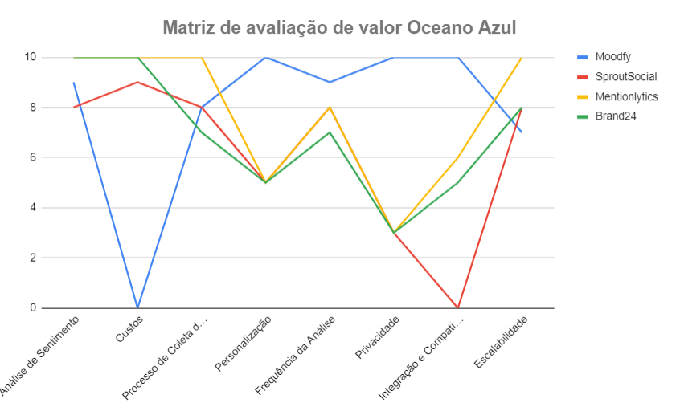 <br>
   Fonte: Autoria Própria. <br>
</p>
   
Para acesso ao gráfico no Google Sheets, acesse o <a href="https://docs.google.com/spreadsheets/d/1zVHOET64fAUjGnMBH_Q6y3pM5ZPdA6d6/edit?usp=sharing&ouid=114207495974472939109&rtpof=true&sd=true">link</a>.

<p align="justify"> 
 &emsp;&emsp;A Sensio destaca-se por oferecer soluções sem custos adicionais e por assegurar a privacidade dos dados dentro da empresa. A solução foi desenvolvida para atender as demandas específicas da Uber, o que a torna um produto altamente personalizado e integrado às operações da empresa. Isso ressalta o seu potencial para estabelecer um novo marco para a análise de sentimentos interna, reforçando a sua posição no mercado.
</p>

### 2.1.2. Matriz de Risco

<p align="justify">
&emsp;&emsp;A matriz de riscos e oportunidades é uma ferramenta analítica importante na administração de projetos, nesse caso está sendo refletida no projeto da Uber para a avaliação de sentimentos dos clientes. Este instrumento analítico possibilita a inspeção detalhada dos obstáculos e benefícios potenciais relacionados ao desempenho do projeto e à gestão da experiência do usuário. Ao identificar riscos, como a recepção negativa dos stakeholders ou a incompatibilidade tecnológica, e ao reconhecer oportunidades como a otimização da satisfação do cliente e a inovação de serviços, esta matriz torna-se fundamental para o alinhamento estratégico, a melhoria contínua e a eficiência do projeto.</p>

<p align="center">
  Figura 3 - Matriz de Risco <br>
  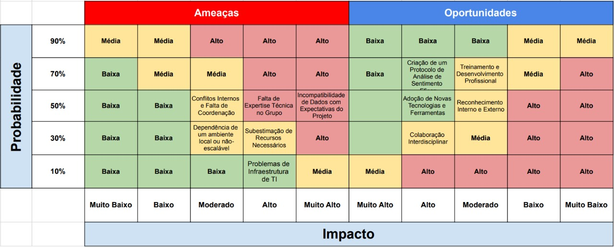 <br>
  Fonte: Elaborado pelos autores <br>
</p>

<b>Ameaças</b>

1. Falta de Expertise Técnica no Grupo: O grupo pode não ter conhecimento suficiente em NLP e ciência de dados para desenvolver eficazmente o projeto.
2. Conflitos Internos e Falta de Coordenação: Desentendimentos ou má comunicação entre os membros do grupo podem atrasar o projeto.
3. Dependência de um Ambiente Local ou Não-Escalável: Usar o Jupyter Notebook pode resultar em limitações de escalabilidade e colaboração, já que esta ferramenta é menos adaptável para ambientes de produção em larga escala.
4. Subestimação de Recursos Necessários: Recursos insuficientes, como tempo ou ferramentas, podem comprometer a qualidade do projeto.
5. Problemas de Infraestrutura de TI: Falhas técnicas podem impedir o progresso do desenvolvimento do projeto.
6. Incompatibilidade de Dados com Expectativas do Projeto: Os dados podem não ser adequados ou suficientes para atender às necessidades do projeto.


<b>Oportunidades</b>

1. Criação de um Protocolo de Análise de Sentimento Eficaz: Possibilidade de desenvolver um sistema robusto para análise de sentimentos que possa ser utilizado de forma ampla.
2. Treinamento e Desenvolvimento Profissional: O projeto serve como uma oportunidade para aprimorar habilidades em NLP e análise de dados.
3. Adoção de Novas Tecnologias e Ferramentas: Implementar tecnologias modernas pode aumentar a eficiência e manter o grupo na vanguarda tecnológica.
4. Reconhecimento Interno e Externo: Sucesso no projeto pode elevar o reconhecimento da equipe dentro e fora da organização.
5. Colaboração Interdisciplinar: Trabalhar com especialistas de diferentes áreas pode enriquecer o projeto com novas ideias e soluções. 


<p align="justify">
&emsp;&emsp;Ao longo da elaboração da Matriz de Risco para o projeto de análise de sentimentos dos clientes da Uber, a equipe delineou três categorias de riscos: "baixo", "médio" e "alto". Essas categorias servem para quantificar a probabilidade e o impacto potencial de cada risco identificado. Em complemento a essa classificação, também foi desenvolvido estratégias de mitigação adequadas para cada risco, de modo a minimizar suas consequências, caso venham a se concretizar. Dessa forma, abaixo está uma lista elaborada que detalha as ameaças identificadas e os correspondentes planos de ação preventiva, assegurando uma resposta rápida e eficaz dentro do contexto do projeto.</p>

#### 2.1.2.1. Estratégias de Mitigação

1. Falta de Expertise Técnica no Grupo: Investir em treinamentos especializados em NLP e ciência de dados para os membros do grupo.

2. Conflitos Internos e Falta de Coordenação:Implementar reuniões regulares de alinhamento e sessões de brainstorming. Utilizar ferramentas de gestão de projetos para melhorar a comunicação e o rastreamento de tarefas.

3. Problemas de Infraestrutura de TI: Realizar uma conversa semanal para garantir que tudo da área de TI esteja funcionando conforme devido.

4. Subestimação de Recursos Necessários: Desenvolver um plano de projeto detalhado com uma estimativa realista de recursos. Realizar revisões periódicas do progresso do projeto para ajustar recursos conforme necessário.

5. Incompatibilidade de Dados com Expectativas do Projeto: Conduzir uma avaliação preliminar detalhada da qualidade e adequação dos dados disponíveis. Se necessário, buscar fontes adicionais de dados ou ajustar o escopo do projeto para alinhar com os dados existentes.

6. Dependência de um Ambiente Local ou Não-Escalável: Investir na construção ou na migração para uma infraestrutura baseada em nuvem. Utilizar tecnologias e serviços que suportam a expansão automática de recursos. Promover práticas de <i>DevOps</i> para melhorar a gestão de ambientes distribuídos.


<p align="justify">
&emsp;&emsp;Concluindo, a matriz de riscos e oportunidades direcionada para o projeto de análise de sentimentos da Uber é importante para o gerenciamento efetivo das variáveis do projeto. Ela não apenas auxilia na identificação das ameaças que podem comprometer a entrega do projeto, mas também abre caminho para a capitalização das possíveis oportunidades. Por meio da identificação antecipada e da gestão de riscos, juntamente com o aproveitamento de oportunidades para o avanço estratégico, a matriz garante uma forma para agregação de valores essenciais para atingir os objetivos do projeto e para reforçar a liderança da Uber no setor de mobilidade.</p>


### 2.1.3. Canvas Proposta de Valor

<p align="justify">
&emsp;&emsp;O Value Proposition Canvas é uma ferramenta de análise de negócios que auxilia na compreensão de como um projeto pode gerar valor para os clientes. Ele é dividido em duas partes: O segmento de clientes e a proposta de valor.</p>

<p align="justify">
&emsp;&emsp;No segmento de clientes, identificamos os ganhos que o cliente espera obter, as dores que deseja evitar e as tarefas que precisa realizar. Este perfil fornece uma visão detalhada das necessidades e desejos do cliente. A seção de tarefas do cliente descreve as atividades que ele precisa realizar para atingir seus objetivos, que podem ser funcionais, sociais, emocionais ou necessidades básicas. Elas também podem envolver diferentes papéis, como comprador, co-criador e transferidor.
</p>

<p align="justify">
&emsp;&emsp;Na proposta de valor, apresentamos os aliviadores de dores e os criadores de ganhos. Os aliviadores de dores demonstram como é o que pode resolver as dores do cliente. Os criadores de ganhos, por outro lado, mostram como o projeto pode gerar benefícios para o cliente. A seção de produtos e serviços lista todos os produtos e serviços que a proposta de valor é construída ao redor, que podem ser tangíveis, digitais/virtuais, intangíveis ou financeiros.</p>

<p align="center">
  Figura 4 - Canvas Proposta de Valor <br>
  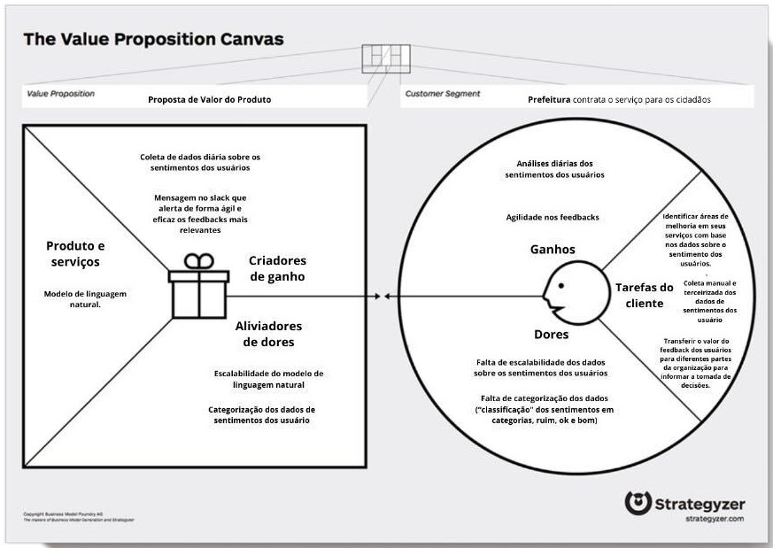 <br>
  Fonte: Elaborado pelos autores <br>
</p>

<p align="justify">
&emsp;&emsp;O  Value Proposition Canvas é uma ferramenta essencial para qualquer negócio que busca entender e atender melhor às necessidades de seus clientes. Ele permite uma análise profunda do perfil do cliente e da proposta de valor, garantindo que ambos estejam alinhados. Ao identificar as dores e os ganhos do cliente, bem como os aliviadores de dores e os criadores de ganhos, é possível criar produtos e serviços que não apenas atendam, mas superem as expectativas do cliente. Além disso, ao explorar diferentes papéis do cliente e tipos de produtos e serviços, a ferramenta oferece uma visão abrangente e diversificada do valor que um projeto pode oferecer. Portanto, o Value Proposition Canvas é uma ferramenta indispensável para qualquer negócio que busca criar valor significativo para seus clientes. [2] </p>


### 2.1.4. Análise Financeira

<p align="justify">
&emsp;&emsp;A realização de uma análise financeira é fundamental para a tomada de decisões estratégicas em projetos corporativos. Por meio dessa análise, é possível avaliar a viabilidade econômica e financeira de um projeto, entender seus potenciais impactos no desempenho financeiro da empresa e determinar se os investimentos propostos são justificáveis.</p>

<p align="justify">
&emsp;&emsp;Neste contexto, a análise financeira assume um papel crucial em projetos como o proposto para a Uber, onde a implementação de novas tecnologias e estratégias pode ter implicações significativas nos custos operacionais, receitas e reputação da empresa. Portanto, compreender os aspectos financeiros do projeto é essencial para garantir que ele contribua positivamente para os objetivos organizacionais e resulte em benefícios tangíveis.</p>

#### Custo de Implantação

&emsp;&emsp;**Infraestrutura Tecnológica**

<p align="justify">
&emsp;&emsp;Considerando que a Uber é uma empresa global e lida com grandes volumes de dados, é importante dimensionar os recursos do Google Cloud [3] adequadamente para atender às necessidades de processamento e armazenamento. Vamos ajustar as estimativas para refletir esse cenário:

1. **Compute Engine (Máquinas Virtuais):**
   Dada a escala global da Uber e a necessidade de processar grandes volumes de dados, pode-se precisar de instâncias de máquinas virtuais poderosas e em grande quantidade. A estimativa para o custo seria de R$ 5.000,00 por mês para várias instâncias de tamanho médio a grande.

2. **Cloud Storage (Armazenamento de Dados):**
   Considerando a quantidade massiva de dados que a Uber lida diariamente, será necessário um armazenamento significativo. A estimativa para o custo seria de R$ 5.000,00 por mês para armazenamento de dados em grande escala.

3. **Cloud Functions (Funções sem Servidor):**
   Pode-se usar funções sem servidor para executar tarefas específicas, como processamento de eventos ou acionamento de fluxos de trabalho. A estimativa para o custo seria de R$ 5.000,00 por mês para cobrir o uso extensivo de funções sem servidor.

4. **Cloud Natural Language API (Processamento de Linguagem Natural):**
   Dado o grande volume de dados textuais e a necessidade de processamento de linguagem natural em escala global, o custo do uso da API pode ser substancialmente maior. A estimativa para o custo seria de R$ 10.000,00 por mês para refletir isso.

<p align="justify">
&emsp;&emsp;Com essas estimativas, o total gasto seria:

- Compute Engine: R$ 5.000,00
- Cloud Storage: R$ 5.000,00
- Cloud Functions: R$ 5.000,00
- Cloud Natural Language API: R$ 10.000,00

<p align="justify">
&emsp;&emsp;Total: R$ 25.000,00/mês

<p align="justify">
&emsp;&emsp;É importante notar que essas estimativas são <strong>apenas uma projeção</strong> e os valores reais podem variar com base nos requisitos específicos do projeto e no uso real dos serviços do Google Cloud Platform.</p>

&emsp;&emsp;**Equipe de Desenvolvimento**

<p align="justify">
&emsp;&emsp;Considerando que o MVP (Minimum Viable Product) seria desenvolvido em um período de 10 semanas, é necessário uma equipe que seja capaz de realizar todas as tarefas necessárias dentro desse prazo, garantindo qualidade e eficiência. Serão considerados os seguintes papéis e justificativas para o número de pessoas e suas respectivas senioridades:</p>

1. **Product Owner (PO) - Senior**
   O Product Owner deve ter uma senioridade alta, pois é responsável por tomar decisões estratégicas e priorizar o backlog do produto. Uma pessoa com experiência relevante em gerenciamento de produtos e um profundo entendimento das necessidades dos usuários e do mercado seria ideal para esse papel.

1. **Engenheiro de Dados - Sênior**
   O Engenheiro de Dados é responsável por projetar, construir e manter os sistemas de armazenamento e processamento de dados necessários para o projeto. Como o projeto envolve processamento de linguagem natural (NLP), é fundamental ter alguém com experiência sólida em lidar com grandes volumes de dados não estruturados e aplicar técnicas de NLP. 

2. **Desenvolvedor Full Stack - Sênior**
   O Desenvolvedor Full Stack é responsável por projetar, desenvolver e implementar tanto o frontend quanto o backend de um aplicativo web, garantindo uma experiência de usuário intuitiva e funcional, bem como uma arquitetura robusta e escalável no lado do servidor. Como Sênior, esse profissional possui uma vasta experiência em todas as camadas da aplicação, desde a interface de usuário até o banco de dados. 

3. **Arquiteto de Software - Sênior**
   O Arquiteto de Software é responsável por definir a estrutura e o design geral da aplicação, garantindo que ela seja escalável, segura e de fácil manutenção. Neste projeto, onde a tecnologia e a arquitetura são cruciais para o sucesso, é essencial ter um Arquiteto de Software sênior que possa tomar decisões de design de alto nível e liderar a equipe na implementação dessas decisões.

4. **UX Designer - Pleno/Sênior**
   O UX Designer é responsável por criar uma experiência de usuário intuitiva e atraente para o produto. Isso envolve a realização de pesquisas de usuários, a criação de wireframes e protótipos, e a colaboração com a equipe de desenvolvimento. Considerando que o MVP é uma versão inicial do produto e o foco principal é validar a viabilidade do conceito, um UX Designer com senioridade Pleno é adequado, pois possui experiência e habilidades para criar uma interface funcional e eficaz, sem a necessidade de refinamentos complexos e detalhados que seriam realizados em fases posteriores do desenvolvimento.

3. **Gerente de Projetos - Senior**
   O Gerente de Projetos deve ter uma senioridade alta para liderar efetivamente a equipe, garantir o cumprimento dos prazos e a qualidade do trabalho entregue. Essa pessoa seria responsável por coordenar as atividades da equipe, resolver problemas e manter uma comunicação eficaz entre todas as partes interessadas.

<p align="justify">
&emsp;&emsp;Portanto, a equipe de desenvolvimento proposta seria composta por:</p>

- 1 **Product Owner** (Sênior) - Faixa de salário base: R$ 9-12 mil/mês
- 1 **Engenheiro de Dados** (Sênior) - Faixa de salário base: R$ 10-14 mil/mês
- 1 **Desenvolvedor Full Stack** (Sênior) - Faixa de salário base: R$ 8-11 mil/mês
- 1 **Arquiteto de Software** (Sênior) - Faixa de salário base: R$ 9-14 mil/mês
- 1 **UX Designer (Pleno)** - Faixa de salário base: R$ 7-10 mil/mês
- 1 **Gestor de Projetos** (Sênior) - Faixa de salário base: R$ 13-20 mil/mês

<p align="justify">
&emsp;&emsp;Essa composição garantirá que a equipe tenha as habilidades e a experiência necessárias para desenvolver e entregar com sucesso o MVP dentro do prazo estipulado, com um equilíbrio adequado entre liderança técnica, experiência em desenvolvimento e foco na experiência do usuário.</p>

&emsp;&emsp;**Custo Total**

<p align="justify">
&emsp;&emsp;Para o cálculo foi considerada a média dos salários base, portanto, sendo o tempo de desenvolvimento 10 semanas, ou dois meses, têm-se: R$ 10.500,00 + R$ 12.000,00 + R$ 9.500,00 + R$ 11.500,00 + R$ 8.500,00 + R$ 16.500,00 = R$ 68.500,00/mês</p>

<p align="justify">
&emsp;&emsp;<i>Obs: As faixas de salário base foram retiradas do site Glassdoor [4]</i></p>

#### Manutenção da Operação (Ano 1 Pós-Desenvolvimento):

<p align="justify">
&emsp;&emsp;Para a manutenção anual após o desenvolvimento, estimamos um custo entre R$759.600 e R$1.245.600, incluindo infraestrutura e equipe técnica durante todo o ano.</p>

#### Disponibilidade de Recursos:

<p align="justify">
&emsp;&emsp;Como parte do projeto do INTELI, a mão de obra para o desenvolvimento será gratuita, portanto o custo de desenvolvimento é praticamente zero, focando apenas nos custos de implantação e manutenção.</p>

#### Projeção de ROI:

<p align="justify">
&emsp;&emsp;O Retorno sobre Investimento (ROI) é uma métrica fundamental no mundo dos negócios que avalia a eficácia e a lucratividade de um investimento. Ele oferece uma maneira de medir o ganho ou perda gerada em relação ao custo inicial do investimento. Em essência, o ROI fornece uma visão clara do valor que um investimento proporciona em relação aos recursos financeiros e esforços dedicados a ele.</p>

<p align="justify">
&emsp;&emsp;O cálculo do ROI é bastante simples e direto. Ele é determinado pela divisão do ganho líquido obtido com o investimento pelo custo inicial do investimento, expresso como uma porcentagem. A fórmula básica para calcular o ROI é:</p>

<p align="center">
  Figura 5 - ROI <br>
   <br>
  Fonte: Autoria Própria. <br>
</p>

<p align="justify">
&emsp;&emsp;Nesta equação, o "Lucro" refere-se ao retorno financeiro total gerado pelo investimento, enquanto o "Custo" representa o montante inicial investido. Multiplicando o resultado por 100%, obtemos o ROI como uma porcentagem.</p>

- Custo Total do Projeto (Desenvolvimento + Manutenção Anual): Entre R$759.600 e R$1.245.600 por ano.

- Receitas Previstas: Ainda não fornecidas. Será necessário estimar com base nas melhorias previstas.

- ROI: Dependerá das receitas previstas e do impacto financeiro real do projeto na Uber. Uma vez que tenhamos esses dados, poderemos calcular o ROI e determinar a viabilidade financeira do projeto.

- Tempo de Retorno do Investimento: Dependerá do ROI calculado e das receitas previstas. Será necessário realizar análises mais detalhadas para determinar esse tempo.

- Ganho Reputacional: Além dos aspectos financeiros, é importante considerar o ganho reputacional, aumento de adesão e seu impacto no mercado de ações da Uber.

<br>

---

<br>

<p align="justify">
&emsp;&emsp;Ao longo desta seção exploramos os componentes da análise financeira relacionados ao projeto com a Uber, examinando os custos envolvidos, potenciais receitas, o cálculo do retorno sobre o investimento (ROI) e outros aspectos relevantes para uma avaliação abrangente da viabilidade do projeto.</p>

<p align="justify">
&emsp;&emsp;Recomendamos que a Uber continue a avaliar cuidadosamente os custos e benefícios do projeto ao longo do tempo, monitorando de perto os resultados e ajustando as estratégias conforme necessário. Ao manter um foco constante na maximização do valor do investimento e na otimização do ROI, a Uber poderá impulsionar o crescimento sustentável e a inovação contínua, fortalecendo sua posição competitiva no mercado.</p>

<p align="justify">
&emsp;&emsp;A análise financeira não é apenas uma ferramenta para avaliar a viabilidade de um projeto, mas sim um processo contínuo de tomada de decisões informadas e alinhadas com os objetivos estratégicos da organização. Ao adotar uma abordagem baseada em dados e centrada no valor, a Uber estará melhor posicionada para enfrentar os desafios do mercado e capitalizar as oportunidades emergentes, impulsionando o sucesso a longo prazo.</p> 

## 2.2 Entendimento da Experiência do Usuário


### 2.2.1 Personas

<p align="justify">
&emsp;&emsp;O desenvolvimento de personas são essenciais para análises de negócios que desejam entender profundamente seus consumidores e adaptar suas ofertas de maneira eficaz. Elas são construídas a partir de uma análise de dados sobre o público-alvo que envolve a solução, representando arquétipos de usuários que encapsulam necessidades, objetivos, hábitos e motivações específicos. Ao utilizar personas no desenvolvimento do projeto, o escopo consegue ficae mais refinado e direcionado para uma tomada de decisão mais concreta e objetiva. Isso resulta em um desenvolvimento mais preciso que realmente atenda às expectativas e resolvem os problemas dos usuários. Além disso, as personas ajudam as equipes internas a visualizar quem são seus usuários, criando uma empatia que orienta a tomada de decisão e a inovação dentro da empresa. Assim, esses modelos ficcionais, mas precisamente embasados, são importantes no alinhamento entre a visão da empresa e as experiências reais dos clientes, garantindo que cada ação da empresa fortaleça a conexão com seu público. [5]
</p>

<p align="center">
  Figura 6 - Persona 1 - Gerente de Monitoramento de Redes Sociais <br>
  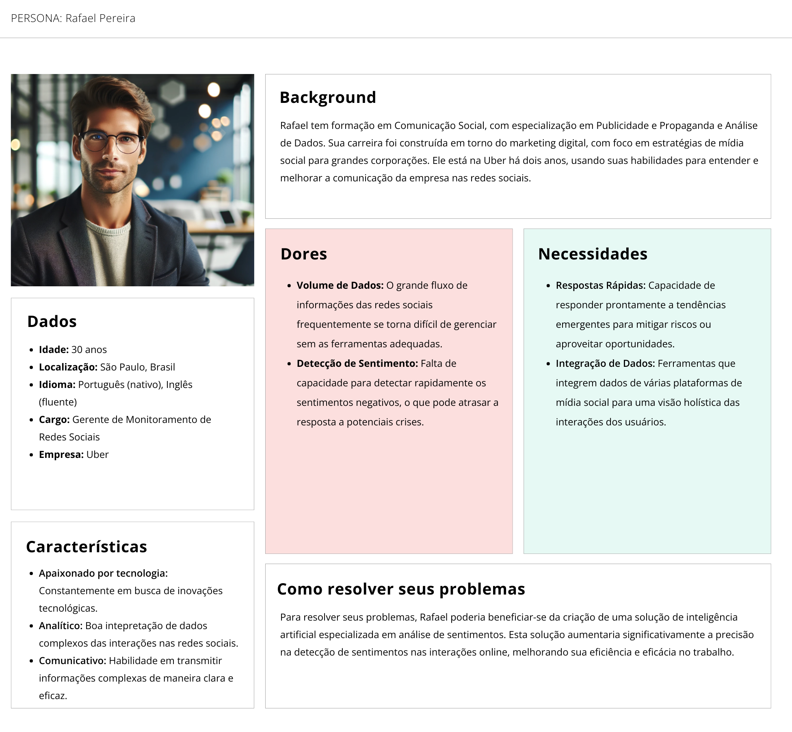 <br>
  Fonte: Elaborado pelos autores <br>
</p>

<br>

<p align="center">
  Figura 7 - Persona 2 - Gerente de Ciência de Dados <br>
   <br>
  Fonte: Elaborado pelos autores <br>
</p>

<p align="justify">
&emsp;&emsp;As personas desempenham um papel crucial no projeto, não apenas para entender os usuários finais, mas também para identificar e atender às necessidades específicas de todos os usuários envolvidos, incluindo a equipe de monitoramento de redes sociais e os administradores da plataforma de dados. Ao desenvolver essas personas, podemos criar uma visão mais holística de como diferentes grupos interagem com a solução proposta. Isso facilita a customização da interface e das funcionalidades da ferramenta de análise de sentimentos para que se adaptem melhor às rotinas diárias e aos fluxos de trabalho específicos de cada usuário. Por exemplo, para os administradores de dados, isso pode significar a implementação de <i>dashboards</i> mais intuitivos e relatórios automatizados que fornecem <i>insights</i> em tempo real, enquanto para a equipe de redes sociais, pode envolver a criação de alertas personalizados e ferramentas de resposta rápida. Integrar essas considerações desde o início do projeto assegura que a solução não apenas melhore a experiência do cliente final, mas também otimize a eficiência operacional e a satisfação no trabalho para a equipe interna, resultando em uma abordagem verdadeiramente centrada no usuário em todos os níveis da implementação. 
</p>

### 2.2.2 _User Stories_

<p align="justify">
&emsp;&emsp;As user stories são uma parte crucial para o desenvolvimento de um projeto, elas visam organizar os requisitos do sistema, sejam eles funcionais ou não funcionais. Priorizando os objetivos do usuário e delineando como o sistema cumpre esses objetivos, as user stories devem ser descrições simples que constroem um quadro claro das funcionalidades esperadas, sempre do ponto de vista do usuário. Cada história é composta por três elementos principais: o ator, que representa o interessado na funcionalidade; a ação, que descreve o que o ator deseja realizar; e a funcionalidade, que detalha o resultado esperado da ação. Essa abordagem não apenas simplifica a comunicação entre as partes interessadas, mas também traz outros benéficios, incluindo a validação da necessidade da funcionalidade, a análise das reais necessidades do usuário e a priorização das tarefas a serem realizadas. As user stories desenvolvidas para o presente projeto são as seguintes: [6] </p>

<p align="center">
  Figura 8 - User Story 1 <br>
   <br>
  Fonte: Elaborado pelos autores <br>
</p>

<p align="center">
  Figura 9 - User Story 2 <br>
   <br>
  Fonte: Elaborado pelos autores <br>
</p>

<p align="center">
  Figura 10 - User Story 3 <br>
   <br>
  Fonte: Elaborado pelos autores <br>
</p>

<p align="center">
  Figura 11 - User Story 4 <br>
   <br>
  Fonte: Elaborado pelos autores <br>
</p>

<p align="center">
  Figura 12 - User Story 5 <br>
   <br>
  Fonte: Elaborado pelos autores <br>
</p>

<p align="center">
  Figura 13 - User Story 6 <br>
   <br>
  Fonte: Elaborado pelos autores <br>
</p>


<p align="justify">
&emsp;&emsp;As user stories auxiliam na priorização de tarefas, permitindo que a equipe se concentre nas funcionalidades de maior valor para o usuário. Por meio dessa abordagem interativa e centrada no usuário, é possível otimizar o processo de desenvolvimento, reduzir o desperdício e garantir que o produto final atenda às necessidades e expectativas da Uber. Todas as user stories possuem seus respectivos critérios de aceitação e testes de aceitação, que são usados para avaliar a completitude destas. Em resumo, o verdadeiro valor das user stories está em seu foco nas necessidades reais e práticas do usuário, promovendo uma abordagem centrada no usuário durante todo o ciclo de desenvolvimento do <i>software</i>.</p>

# <a id="c3"></a>3. Modelo de classificação

&emsp;&emsp;Nesta seção, detalhamos o processo completo de desenvolvimento do modelo de classificação que será usado no projeto. Iniciamos com uma análise exploratória do corpus, onde examinamos as características dos dados textuais que fundamentam nosso modelo. Em seguida, abordamos as etapas de pré-processamento, essenciais para transformar os textos brutos em um formato adequado para a modelagem. Este processo inclui técnicas como remoção de stopwords, lematização e tokenização. Posteriormente, discutimos a vetorização, onde os textos são convertidos em representações numéricas utilizáveis pelos algoritmos de <i>machine learning</i>. Por fim, apresentamos o desenvolvimento, treinamento e avaliação dos modelos de <i>machine learning</i> testados, destacando os parâmetros e métricas que levaram à definição do modelo final empregado no projeto.

## 3.1 Análise Exploratória do corpus

### 3.1.1	Introdução

<p align="justify">
&emsp;&emsp;A exploração de dados é uma etapa crucial no desenvolvimento de modelos que classificam sentimentos, especialmente quando lidamos com dados complexos, como comentários de usuários. Neste projeto, o grupo Moodfy realizou um estudo detalhado de um conjunto de comentários sobre a Uber, coletados da plataforma X (anteriormente conhecida como Twitter). O objetivo dessa análise preliminar era compreender melhor os dados, identificar padrões e preparar o terreno para a criação de um modelo capaz de classificar os comentários como positivos, negativos ou neutros. Este trabalho inicial é vital para garantir que o modelo final seja preciso e eficaz, influenciando decisões importantes sobre como atender e se comunicar com os clientes. [7] </p>
   
### 3.1.2	Descrição dos gráficos
<p align="justify">
&emsp;&emsp;1. Distribuição de Sentimentos: 

<p align="center">
  Figura 14 - Distribuição de Sentimentos <br>
  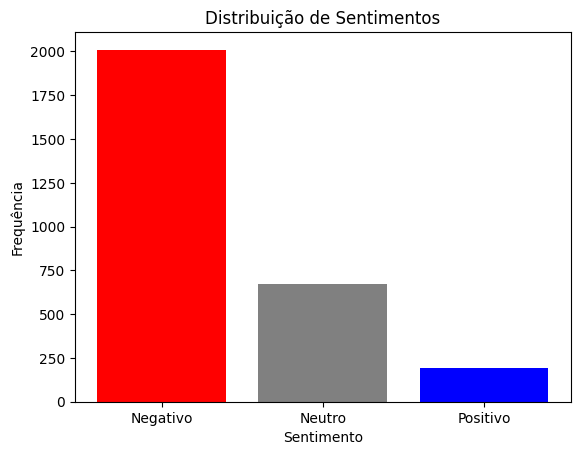 <br>
  Fonte: Elaborado pelos autores <br>
</p>

<p align="justify">
&emsp;&emsp;O gráfico apresentado é um diagrama de barras que representa a “Distribuição de Sentimentos” nos comentários analisados pelo grupo Moodfy. 

<p align="justify">
&emsp;&emsp;No eixo X, temos as categorias de sentimentos: Negativo, Neutro e Positivo. No eixo Y, temos a frequência, que representa o número de comentários para cada categoria de sentimento. 

<p align="justify">
&emsp;&emsp;A barra vermelha representa os comentários negativos, a barra cinza representa os comentários neutros e a barra azul representa os comentários positivos. A altura de cada barra indica a quantidade de comentários para cada sentimento. 

<p align="justify">
&emsp;&emsp;Observando o gráfico, podemos ver que há um desequilíbrio na distribuição dos sentimentos. A barra vermelha, que representa os comentários negativos, é significativamente mais alta do que as outras, indicando que há um número maior de comentários negativos. Isso significa que a maioria dos comentários analisados expressa um sentimento negativo. 

<p align="justify">
&emsp;&emsp;As barras cinza e azul, que representam os comentários neutros e positivos, respectivamente, são muito mais baixas em comparação com a barra vermelha. Isso indica que os comentários neutros e positivos são menos frequentes.
<p align="justify">
&emsp;&emsp;Este desequilíbrio na distribuição dos sentimentos é importante, pois pode influenciar o desempenho do modelo futuro. Se a maioria dos dados de treinamento for de uma categoria específica (neste caso, negativa), o modelo pode ser tendencioso para essa categoria. Portanto, é crucial levar em consideração esse desequilíbrio ao desenvolver o modelo de classificação de sentimentos.</p>

<p align="justify">
&emsp;&emsp;2. Análise de Palavras Comuns em Comentários:

<p align="center">
  Figura 15 - Análise de palavras comuns em comentários negativos <br>
  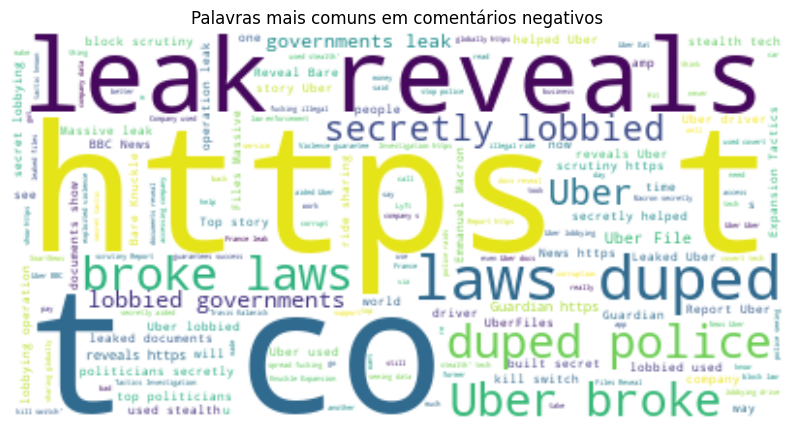 <br>
  Fonte: Elaborado pelos autores <br>
</p>

<p align="justify">
&emsp;&emsp;A imagem apresentada é uma nuvem de palavras que destaca as palavras mais comuns encontradas em comentários negativos. As palavras que se destacam incluem “leak” (vazamento), “https”, “reveal” (revelar), “lobbied” (fez lobby), “laws” (leis), “duped” (enganado) e “police” (polícia). Essas palavras-chave dão uma visão sobre os tópicos que são frequentemente mencionados em comentários negativos. Essa informação pode ser útil para identificar áreas de preocupação para os usuários e pode ajudar a informar estratégias de melhoria do serviço. No entanto, é importante lembrar que a presença dessas palavras por si só não determina o sentimento de um comentário. O contexto em que essas palavras são usadas também é crucial para entender o sentimento geral do comentário.</p>

<p align="center">
  Figura 16 - Análise de palavras comuns em comentários neutros <br>
  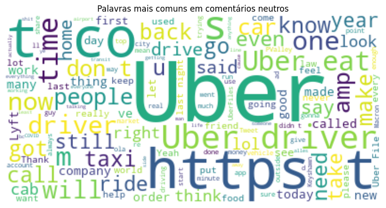 <br>
  Fonte: Elaborado pelos autores <br>
</p>

<p align="justify">
&emsp;&emsp;A imagem apresentada é uma nuvem de palavras que representa as palavras mais comuns encontradas em comentários neutros. As palavras estão em várias cores e tamanhos, indicando a frequência com que aparecem nos comentários. As palavras que se destacam incluem “Uber”, “driver” e “time”, sugerindo que são temas comuns nos comentários neutros. Outras palavras notáveis incluem termos relacionados a serviços de transporte como “car”, “ride”, “taxi” e termos gerais como “people”, “now”, e “dont”. A presença dessas palavras indica os tópicos que são frequentemente discutidos em comentários neutros. Isso pode dar uma visão sobre as áreas de foco dos usuários quando eles não estão expressando sentimentos particularmente positivos ou negativos. A frequência de uma palavra não necessariamente indica sua importância ou impacto no sentimento geral de um comentário. Por exemplo, palavras comuns como “the” e “and” podem aparecer com frequência, mas não contribuem significativamente para o sentimento. Portanto, ao analisar os dados, é importante considerar tanto a frequência quanto o contexto das palavras.</p>

<p align="center">
  Figura 17 - Análise de palavras comuns em comentários positivos <br>
  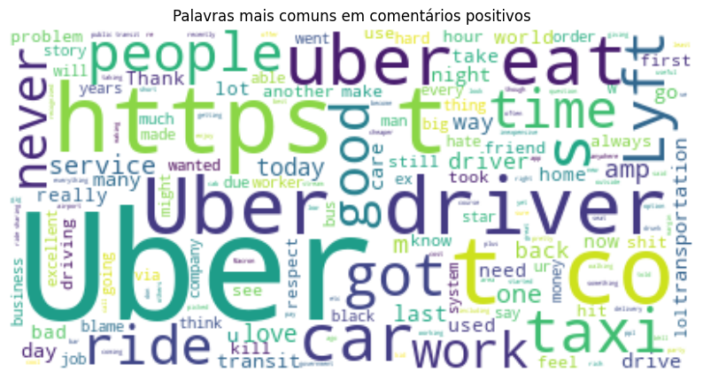 <br>
  Fonte: Elaborado pelos autores <br>
</p>
   
<p align="justify">
&emsp;&emsp;A imagem apresentada é uma representação gráfica, conhecida como nuvem de palavras, que ilustra as palavras mais recorrentes em comentários com sentimentos positivos. As palavras são apresentadas em diferentes tamanhos e cores, o que reflete a frequência de sua aparição nos comentários. Palavras como “Uber”, “driver”, “good” e “time” são proeminentes, indicando que são temas frequentes nos comentários positivos. Além disso, termos associados a serviços de transporte, como “car”, “ride”, “taxi”, e palavras gerais como “people”, “now”, e “dont” também são notáveis. A presença dessas palavras fornece uma visão dos assuntos que são comumente discutidos em comentários positivos. Isso pode oferecer uma compreensão das áreas de interesse dos usuários quando eles expressam sentimentos positivos. Assim como mencionado nas análises de palavras frequentes em comentários negativos e neutros, é crucial considerar tanto o contexto quanto a frequência das palavras. Esses fatores são fundamentais para extrair <i>insights</i> significativos e compreender melhor os sentimentos expressos nos comentários. A frequência de uma palavra pode indicar sua relevância, enquanto o contexto em que é usada pode esclarecer seu significado e impacto no sentimento geral do comentário. Portanto, uma análise mais profunda desses aspectos pode fornecer informações valiosas e orientar estratégias eficazes.</p>

<p align="justify">
&emsp;&emsp;3. Análise do Comprimento dos Comentários:

<p align="center">
  Figura 18 - Análise do Comprimento dos Comentários: <br>
  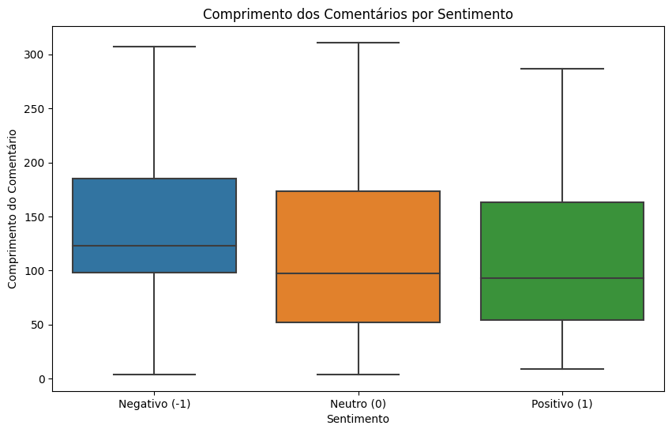 <br>
  Fonte: Elaborado pelos autores <br>
</p>

<p align="justify">
&emsp;&emsp;A imagem apresentada é um gráfico de caixa (boxplot) que representa a distribuição do comprimento dos comentários, categorizados por sentimentos: negativo, neutro e positivo. No eixo X, temos as categorias de sentimentos: Negativo (-1), Neutro (0) e Positivo (1). No eixo Y, temos o comprimento dos comentários.</p>

<p align="justify">
&emsp;&emsp;Análise dos resultados obtidos:</p>

- Negativo: A caixa azul mostra que os comentários negativos têm uma variação de comprimento considerável. A mediana parece estar mais para o final superior dessa faixa, indicando que muitos comentários negativos tendem a ser mais longos.

- Neutro: A caixa laranja para os comentários neutros mostra uma distribuição mais compacta. A mediana está mais para o meio dessa faixa, sugerindo que os comentários neutros tendem a ter um comprimento moderado ou curto.

- Positivo: A caixa verde para os comentários positivos indica que eles têm uma ampla variação de comprimento, semelhante aos comentários neutros. No entanto, a mediana está mais para o final inferior dessa faixa, o que sugere que muitos comentários positivos tendem a ser mais curtos.

<p align="justify">
&emsp;&emsp;A partir desta análise, pode-se inferir que, embora os comentários negativos, neutros e positivos tenham sobreposições consideráveis em seus comprimentos, há tendências distintas. Os comentários negativos tendem a ser mais longos, enquanto os comentários positivos são geralmente mais curtos.

<p align="justify">
&emsp;&emsp;4. Frequência de Palavras por Sentimento: 

<p align="center">
  Figura 19 - Frequência de Palavras por Sentimento <br>
   <br>
  Fonte: Elaborado pelos autores <br>
</p>

<p align="justify">
&emsp;&emsp;A imagem apresentada contém três gráficos de barras que representam as palavras mais frequentes encontradas em comentários negativos, neutros e positivos, respectivamente. Com as cores representando os sentimentos da seguinte forma: vermelho para negativo, cinza para neutro e verde para positivo.</p>
   
- Comentários Negativos: O primeiro gráfico, em vermelho, mostra a frequência de palavras em comentários negativos. A palavra “Uber” é a mais mencionada, seguida por “and”, “to”, “the”, “leak”, “secretly”, “reveals”, “police”, “laws” e “duped”. Isso sugere que esses termos são comumente usados quando os usuários expressam sentimentos negativos em relação ao Uber.

- Comentários Neutros: O segundo gráfico, em cinza, representa a frequência de palavras em comentários neutros. As palavras “the”, “to”, “Uber”, “and”, “a”, “I”, “of”, “in”, “for” e “is” são as mais frequentes. Isso pode indicar que os usuários tendem a usar uma linguagem mais neutra e genérica ao discutir o Uber sem expressar sentimentos fortemente positivos ou negativos.

- Comentários Positivos: O terceiro gráfico, em verde, mostra a frequência de palavras em comentários positivos. Novamente, a palavra “Uber” é uma das mais mencionadas, junto com “the”, “to”, “a”, “I”, “and”, “of”, “for” e “in”. Isso sugere que esses termos são frequentemente usados quando os usuários expressam sentimentos positivos em relação ao Uber.

<p align="justify">
&emsp;&emsp;Esses gráficos fornecem uma visão visual da frequência de palavras em diferentes tipos de comentários, ajudando a entender quais termos são comumente usados para expressar diferentes sentimentos em relação ao Uber. No entanto, é importante lembrar que a frequência de uma palavra não necessariamente reflete seu impacto no sentimento geral de um comentário. O contexto em que a palavra é usada também é crucial para entender o sentimento expresso pelo usuário.</p>

<p align="justify">
&emsp;&emsp;5. Correlação entre o Comprimento do Comentário e o Sentimento:

<p align="center">
  Figura 20 - Correlação entre o Comprimento do Comentário e o Sentimento <br>
  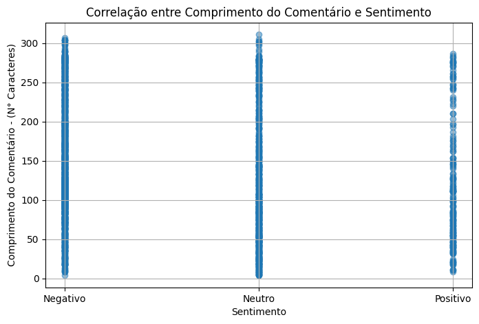 <br>
  Fonte: Elaborado pelos autores <br>
</p>

<p align="justify">
&emsp;&emsp;A imagem apresentada é um gráfico de dispersão que explora a relação entre o comprimento dos comentários e o sentimento expresso. Cada ponto no gráfico representa um comentário individual, com sua posição determinada pelo sentimento expresso (negativo, neutro ou positivo) e pelo comprimento do comentário.</p>
   
- Eixo X (Sentimentos): Este eixo categoriza os comentários em três sentimentos distintos: negativo, neutro e positivo.

- Eixo Y (Comprimento do Comentário): Este eixo representa o comprimento dos comentários, medido em número de caracteres.

- Pontos: Cada ponto no gráfico representa um comentário individual. A posição vertical do ponto indica o comprimento do comentário, enquanto a posição horizontal indica o sentimento expresso no comentário.

<p align="justify">
&emsp;&emsp;Analisando o gráfico, podemos observar que:</p>

- Comentários Negativos: Os pontos representando comentários negativos estão concentrados na parte superior do gráfico, indicando que a maioria desses comentários é mais longa.

- Comentários Neutros: Os pontos representando comentários neutros estão distribuídos de maneira mais uniforme ao longo do eixo Y, sugerindo que o comprimento desses comentários varia mais amplamente.

- Comentários Positivos:  Os pontos representando comentários positivos estão concentrados na parte inferior do gráfico, indicando que a maioria desses comentários é relativamente curta.

<p align="justify">
&emsp;&emsp;A partir desta análise, pode-se inferir que o comprimento dos comentários pode estar relacionado ao sentimento expresso. Comentários negativos tendem a ser mais longos, enquanto comentários positivos tendem a ser mais curtos. No entanto, é importante notar que esta é uma tendência geral e pode haver exceções. Além disso, outros fatores, como o conteúdo e o contexto do comentário, também podem influenciar o sentimento expresso. Portanto, embora o comprimento do comentário possa fornecer alguns <i>insights</i>, uma análise mais aprofundada do conteúdo dos comentários seria necessária para uma compreensão mais completa dos sentimentos expressos pelos usuários.</p>

<p align="justify">
&emsp;&emsp;6. Média do Comprimento dos Comentários por Sentimento:

<p align="center">
  Figura 21 - Média do Comprimento dos Comentários por Sentimento <br>
  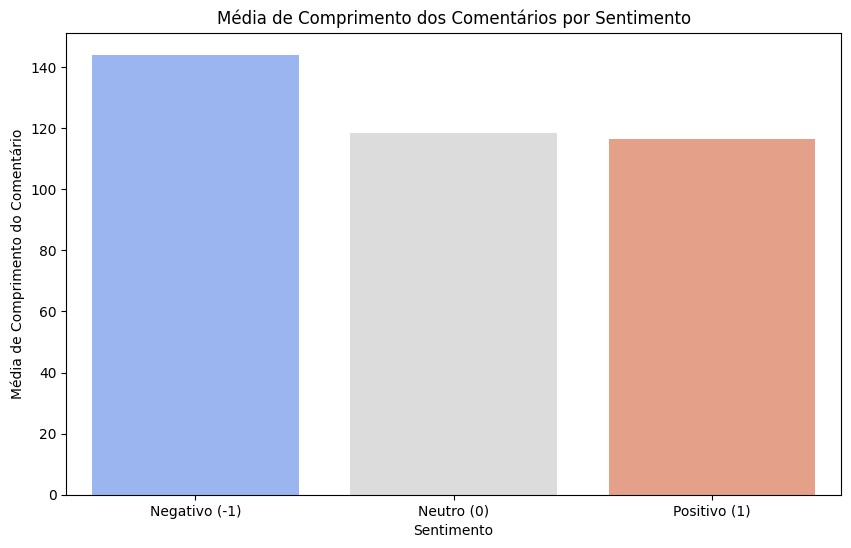 <br>
  Fonte: Elaborado pelos autores <br>
</p>

<p align="justify">
&emsp;&emsp;A imagem apresentada é um gráfico de barras que ilustra a média do comprimento dos comentários para cada categoria de sentimento: negativo, neutro e positivo.</p>
   
- Eixo X (Sentimentos): Este eixo categoriza os comentários em três sentimentos distintos: negativo, neutro e positivo.

- Eixo Y (Média do Comprimento do Comentário): Este eixo representa a média do comprimento dos comentários, medido em número de caracteres.

- Barras: Cada barra no gráfico representa a média do comprimento dos comentários para uma determinada categoria de sentimento. A barra azul representa os comentários negativos, a barra cinza representa os comentários neutros e a barra vermelha representa os comentários positivos.

<p align="justify">
&emsp;&emsp;Analisando o gráfico, podemos observar que:</p>

- Comentários Negativos: A barra azul é significativamente mais alta do que as outras, indicando que os comentários negativos tendem a ser mais longos em média.

- Comentários Neutros: A barra cinza é mais curta em comparação com a barra azul, sugerindo que os comentários neutros tendem a ser mais curtos em média.

- Comentários Positivos: A barra vermelha é ligeiramente mais alta do que a barra cinza, mas muito mais curta do que a barra azul. Isso indica que, embora os comentários positivos sejam, em média, mais longos do que os comentários neutros, eles são significativamente mais curtos do que os comentários negativos.

<p align="justify">
&emsp;&emsp;A partir desta análise, pode-se inferir que os usuários tendem a escrever comentários mais longos quando expressam sentimentos negativos. Isso pode ser devido à necessidade de explicar ou justificar suas insatisfações ou preocupações. Por outro lado, quando os sentimentos são neutros ou positivos, os usuários tendem a ser mais concisos em seus comentários. No entanto, é importante notar que esta é uma tendência geral e pode haver exceções. Além disso, outros fatores, como o conteúdo e o contexto do comentário, também podem influenciar o comprimento do comentário. Portanto, embora o comprimento do comentário possa fornecer alguns <i>insights</i>, uma análise mais aprofundada do conteúdo dos comentários seria necessária para uma compreensão mais completa dos sentimentos expressos pelos usuários.</p>
   
### 3.1.3	Estatísticas Gerais

<p align="justify">
&emsp;&emsp;A análise exploratória do corpus de comentários sobre a Uber revelou várias tendências. A distribuição de sentimentos nos comentários é desequilibrada, com uma predominância de comentários negativos. Isso sugere que muitos usuários expressam insatisfação ou problemas com o serviço.</p>

<p align="justify">
&emsp;&emsp;A análise de palavras comuns nos comentários revelou que certos tópicos e termos são frequentemente mencionados em diferentes categorias de sentimentos. Por exemplo, palavras como “leak”, “https”, “reveal”, “lobbied”, “laws”, “duped” e “police” são comuns em comentários negativos, enquanto palavras como “Uber”, “driver” e “time” são frequentes em comentários neutros e positivos.</p>

<p align="justify">
&emsp;&emsp;A análise do comprimento dos comentários mostrou que os comentários negativos tendem a ser mais longos, enquanto os comentários positivos são geralmente mais curtos. Os comentários neutros tendem a ter um comprimento moderado.
A correlação entre o comprimento do comentário e o sentimento mostrou que os comentários mais longos tendem a ser negativos, enquanto os comentários mais curtos tendem a ser positivos. Os comentários neutros têm uma variação de comprimento mais ampla.</p>

### 3.1.4	Conclusão

<p align="justify">
&emsp;&emsp;A análise exploratória do corpus de comentários sobre a Uber, nos permite formular uma estratégia eficaz para o desenvolvimento de um modelo de classificação de sentimentos. A análise estatística de um corpus envolve a compreensão da distribuição de palavras, a frequência de tópicos específicos e a relação entre diferentes elementos do texto. Isso pode incluir a análise de n-gramas, a identificação de colocações e a análise de concordância.</p>

<p align="justify">
&emsp;&emsp;Essas técnicas nos permitem entender melhor a estrutura e os padrões dentro do corpus. Ao aplicar essas técnicas ao corpus de comentários da Uber, observamos que uma predominância de comentários negativos é uma tendência de comentários mais longos serem negativos. Essas observações são cruciais para o treinamento do nosso modelo, pois indicam que o modelo deve ser sensível ao comprimento do comentário e ao tom negativo. Além disso, a identificação de palavras e tópicos comuns em diferentes categorias de sentimentos pode ajudar a melhorar a precisão do modelo. Isso sugere que o modelo deve ser capaz de reconhecer e aprender a partir desses padrões recorrentes.</p>

<p align="justify">
&emsp;&emsp;A combinação de uma análise exploratória detalhada com uma compreensão sólida das técnicas de análise estatística utilizadas, nos permite desenvolver um modelo de classificação de sentimentos preciso.</p>

## 3.2 Pré Processamento

<p align="justify">
O o pré-processamento é o alicerce sobre o qual se constrói uma análise linguística eficaz em PLN. Antes que um algoritmo de PLN possa entender e interpretar informações de texto, é necessário preparar os dados de entrada de maneira adequada. A etapa de pré-processamento envolve uma série de técnicas, como tokenização, remoção de pontuação, normalização de texto, remoção de stop words e stemming ou lematização. Essas técnicas têm o objetivo de limpar e organizar o texto, tornando-o mais fácil de ser compreendido e processado por algoritmos de aprendizado de máquina ou outras técnicas de análise de texto. A importância do pré-processamento reside na melhoria da precisão e eficiência dos modelos, ajudando a reduzir a ambiguidade, ruído e o processamento desnecessário de informações, o que leva a resultados mais precisos e relevantes.</p>

### 3.2.1 Etapas

<p align="justify">
&emsp;&emsp;A seguir, estão listadas as etapas de pré processamento realizadas:

**Balanceamento das Classes de Dados**
<p align="justify">
&emsp;&emsp;O balanceamento das classes de dados é um processo crucial em tarefas de aprendizado de máquina, especialmente quando as classes estão desproporcionalmente representadas nos dados. Em muitos casos, um conjunto de dados pode ter uma classe dominante, o que pode levar a um viés no modelo devido à sua tendência a favorecer a classe majoritária.</p>

<p align="justify">
&emsp;&emsp;Em nosso <i>dataset</i> enfrentamos esse problema. Para resolver isso, realizamos o balanceamento das classes, onde ajustamos a distribuição das classes para torná-las mais equilibradas. Retiramos 40% dos dados negativos, aleatoriamente para evitar o enviesamento do modelo, e duplicamos os dados positivos, para assim tornar a base equilibrada.</p>

<p align="justify">
&emsp;&emsp;Essa abordagem ajuda a garantir que o modelo não seja tendencioso em relação a uma classe específica, permitindo que ele aprenda de maneira mais equilibrada com relação a todas as classes. O balanceamento das classes é importante para garantir que o modelo seja capaz de generalizar bem para dados de todas as classes e produzir resultados mais confiáveis e justos.</p>

**Tokenização** 
<p align="justify">
&emsp;&emsp;Processo de dividir um texto em unidades menores, chamadas de tokens. Esses tokens podem ser palavras individuais, frases, caracteres ou qualquer outra unidade significativa. A tokenização é importante porque ajuda a estruturar o texto em uma forma que pode ser processada mais facilmente por algoritmos de PLN.</p>

**Lemmatização** 
<p align="justify">
&emsp;&emsp;A lematização é o processo de reduzir palavras flexionadas ao seu lema ou forma básica. Por exemplo, transforma "correram" em "correr". Isso simplifica o texto, permitindo tratar diferentes formas da mesma palavra como uma só. Essencial para reduzir complexidade e melhorar a precisão em tarefas de PLN, preservando relações semânticas importantes.</p>

**Remoção de Pontuação**
<p align="justify">
&emsp;&emsp;Envolve a eliminação de todos os caracteres de pontuação do texto, como vírgulas e pontos. Isso é importante porque a pontuação geralmente não contribui para o significado do texto e pode interferir na análise.</p>

**Remoção de Números**
<p align="justify">
&emsp;&emsp;Consiste na exclusão de todos os caracteres numéricos do texto. Isso é útil especialmente quando o objetivo da análise é entender o significado do texto sem considerar números, como em análises de sentimento, que é o objetivo do projeto.</p>

**Remoção de Stop Words**
<p align="justify">
&emsp;&emsp;As stop words são palavras comuns que geralmente não contribuem para o significado de uma frase e por isso são removidas durante o pré-processamento. Exemplos de stop words incluem "e", "ou", "de", "para", entre outras. Removê-las ajuda a reduzir a dimensionalidade do texto e focar nas palavras importantes, além de diminuir o tamanho do vetor gerado pelo Bag Of Words.</p>

**Remoção de links**
<p align="justify">
&emsp;&emsp;Essa etapa envolve a eliminação de URLs ou links da entrada de texto. Em muitos casos de análise de texto, como o do projeto, os links não fornecem informações relevantes para a compreensão do conteúdo e podem ser considerados ruído. Portanto, remover os links ajuda a simplificar o texto e concentrar nos aspectos significativos de fato.</p>

**Correção de texto**
<p align="justify">
&emsp;&emsp;A etapa de correção de texto no processamento de linguagem natural (NLP) envolve a identificação e correção de erros gramaticais em um texto. Isso inclui a correção de erros de concordância verbal e nominal, uso incorreto de tempos verbais, pontuação inadequada e outros aspectos gramaticais. Ferramentas de correção gramatical utilizam algoritmos e modelos linguísticos para analisar a estrutura das sentenças e sugerir melhorias, garantindo que o texto final seja gramaticalmente correto e claro. Esta etapa é crucial para melhorar a qualidade e a legibilidade do texto, especialmente em aplicações como assistentes de escrita, corretores ortográficos e sistemas de tradução automática.</p>

**Contrações**
<p align="justify">
&emsp;&emsp;A etapa de correção de contrações envolve a expansão de palavras contraídas em suas formas completas. Por exemplo, transformar "can't" em "cannot" ou "it's" em "it is". Essa etapa é importante no processamento de linguagem natural (NLP) porque as contrações podem introduzir ambiguidades e dificuldades na análise de texto. Ao expandir as contrações, o texto se torna mais claro e consistente para os algoritmos, melhorando a precisão em tarefas como análise de sentimentos, tradução automática e extração de informações.</p>

**Criação de uma nova coluna**
<p align="justify">
&emsp;&emsp;A coluna words_sentiment é adicionada ao <i>DataFrame</i> para indicar o sentimento de cada comentário com base na presença de palavras positivas ou negativas. O valor da coluna é determinado da seguinte maneira: 1 se o comentário contiver qualquer palavra positiva, -1 se o comentário contiver qualquer palavra negativa, e 0 se o comentário não contiver nem palavras positivas nem negativas.</p>

--- 

**Figura do Pipeline**
<p>Com base nessas etapas, o Pipeline desenvolvido ficou da seguinte forma:</p>

```python
# Definir o pipeline para pré-processamento dos comentários
pipeline = Pipeline([
    ('expand_contractions', FunctionTransformer(lambda x: x.apply(expand_contractions))),
    ('url_remover', FunctionTransformer(lambda x: x.apply(remove_urls))),
    ('tokenizer', FunctionTransformer(lambda x: x.apply(tokenize_text))),
    ('lemmatizacao', FunctionTransformer(lambda x: x.apply(lemmatize_tokens_with_pos))),
    ('punctuation_remover', FunctionTransformer(lambda x: x.apply(remove_punctuation_from_tokens))),
    ('number_remover', FunctionTransformer(lambda x: x.apply(remove_numbers_from_tokens))),
    ('stopwords_remover', FunctionTransformer(lambda x: x.apply(remove_stopwords_preserve_adverbs_conjunctions))),
    ('filter_empty_tokens', FunctionTransformer(lambda x: x.apply(filter_empty_tokens))),
    ('spell_checker', FunctionTransformer(lambda x: x.apply(spell_checker))),
])

# Primeiro aplicar a remoção de outliers e a redução de dados negativos
df = remove_outliers_balance_negatives_and_multiply_positives(df)
# Aplicar o pipeline ao DataFrame existente
df['comment'] = pipeline.fit_transform(df['comment'])
# Verificar a presença de palavras positivas e negativas em cada comentário e adicionar uma nova coluna
df = has_sentiment_words(df)
```


<p align="justify">
&emsp;&emsp;Ao preparar os dados adequadamente, facilitamos o entendimento e a interpretação das informações por algoritmos de PLN. Com técnicas como tokenização, lematização e remoção de elementos indesejados como pontuação, números, stop words e links, buscamos limpar e organizar o texto, tornando-o mais fácil de ser processado. Além disso, o balanceamento das classes de dados é crucial para evitar viés no modelo, garantindo que ele seja capaz de generalizar bem para todas as classes. Em resumo, o pré-processamento não apenas melhora a precisão e eficiência dos modelos, mas também contribui para resultados mais relevantes e confiáveis.</p>

### 3.2.2 Comparação Gráficos após Pré-Processamento

&emsp;&emsp;O tópico a seguir será pautado na comparação dos gráficos e dados antes e após o pré-processamento, ou seja, este tópico buscar entender o que ocorreu com os dados após a etapa de limpeza. Na seção de análise do corpus foram gerados os seguintes gráficos:

<p align="center">
  Figura 22 - Distribuição de Sentimentos <br>
   <br>
  Fonte: Elaborado pelos autores <br>
</p>

--- 

<p align="center">
  Figura 23 - Análise de palavras comuns em comentários negativos <br>
   <br>
  Fonte: Elaborado pelos autores <br>
</p>

--- 

<p align="center">
  Figura 24 - Análise de palavras comuns em comentários neutros <br>
   <br>
  Fonte: Elaborado pelos autores <br>
</p>

--- 

<p align="center">
  Figura 25 - Análise de palavras comuns em comentários positivos <br>
   <br>
  Fonte: Elaborado pelos autores <br>
</p>

--- 

<p align="center">
  Figura 26 - Análise do Comprimento dos Comentários: <br>
   <br>
  Fonte: Elaborado pelos autores <br>
</p>

--- 

<p align="center">
  Figura 27 - Frequência de Palavras por Sentimento <br>
   <br>
  Fonte: Elaborado pelos autores <br>
</p>


--- 

<p align="center">
  Figura 28 - Correlação entre o Comprimento do Comentário e o Sentimento <br>
   <br>
  Fonte: Elaborado pelos autores <br>
</p>

--- 

<p align="center">
  Figura 29 - Média do Comprimento dos Comentários por Sentimento <br>
   <br>
  Fonte: Elaborado pelos autores <br>
</p>

---

<br><br>
&emsp;&emsp;Com base nesses gráficos foram decididas as técnicas de pré-processamento aplicadas ao <i>dataset</i>, como o objetivo de preparar os dados e enfim treinar e testar os modelos de <i>machine learning</i>. A fim de compararmos os dados temos os gráficos gerados após o pré-processamento:
<br><br>

<p align="center">
  Figura 30 - Distribuição de Sentimentos pós pré-processamento<br>
  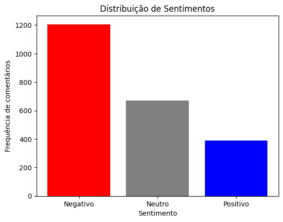 <br>
  Fonte: Elaborado pelos autores <br>
</p>

&emsp;&emsp; Com o pré-processamento foram retirados, aleatoriamente, 40% dos dados da classe negativa e duplicados os dados da classe positiva, dessa maneira, o grau de desbalanceamento diminuiu considerávelmente. Contudo, ainda há uma notável diferença entre as classes, mesmo após o pré-processamento, os comentários negativos correspondem a mais de 50% do <i>Dataset</i>, o que pode enviesar o modelo e prejudicar os resultados. Com base nisso, uma nova etapa de pré-processamento será necessária para igualar as classes.

---

<p align="center">
  Figura 31 - Análise de palavras comuns em comentários negativos pós pré-processamento<br>
  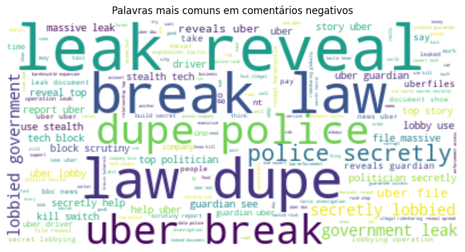 <br>
  Fonte: Elaborado pelos autores <br>
</p>

<p align="center">
  Figura 32 - Análise de palavras comuns em comentários neutros pós pré-processamento<br>
  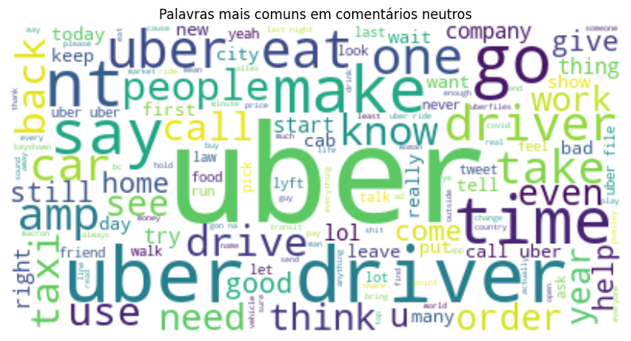 <br>
  Fonte: Elaborado pelos autores <br>
</p>

<p align="center">
  Figura 33 - Análise de palavras comuns em comentários positivos pós pré-processamento <br>
  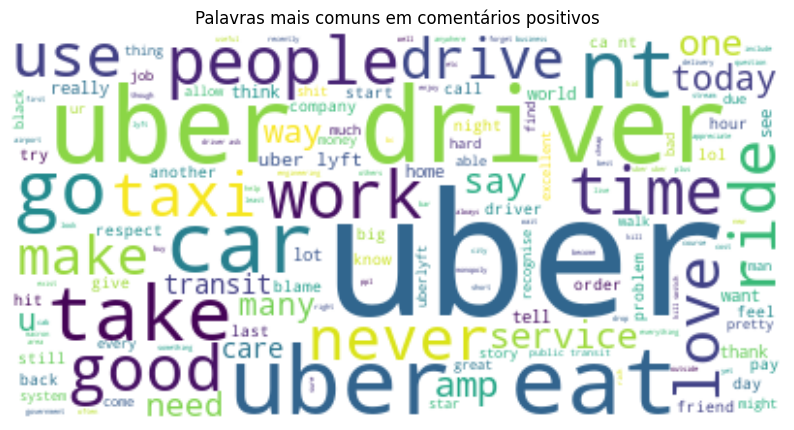 <br>
  Fonte: Elaborado pelos autores <br>
</p>

&emsp;&emsp; Para os três gráficos acima foi aplicada a mesma abordagem, retirada de links e stopwords, palavras que apareciam predominantes em nosso corpus. Após o pré-processamento é possível notar as palavras que mais aparecem são aquelas que agregam valor ao nosso modelo, aumentando a qualidade dos dados e assim cooperando para melhores resultados. Posterior as etapas de retirada de links e stopwords, a palavra que aparece mais vezes em meio aos dados é "uber", o que permitirá o modelo identificar o que está mais relacionado a palavra "uber", se são comentários positivos, negativos ou neutros, contribuindo para a análise dos sentimentos em relação à marca e possíveis ataques de marca.

---

<p align="center">
  Figura 34 - Média do Comprimento dos Comentários por Sentimento pós pré-processamento <br>
  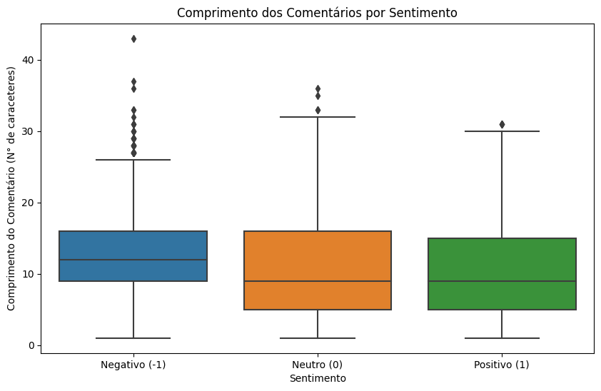 <br>
  Fonte: Elaborado pelos autores <br>
</p>

&emsp;&emsp; Com base no gráfico é possível notar que a média de caractéres é maior para a classe de tweets negativos, o que leva à conclusão de que as pessoas tendem a escrever mais quando estão insatisfeitas do que quando querem expor algum elogio. Além disso, nota-se também que há a presenção de alguns outliers, principalmente na classe dos negativos, o que pode resultar em uma nova etapa de pré-processamento futuramente, retirando esses outliers e verificando se dessa forma é possível chegar em resultados melhores.

---

<p align="center">
  Figura 35 - Frequência de Palavras por Sentimento pós pré-processamento<br>
  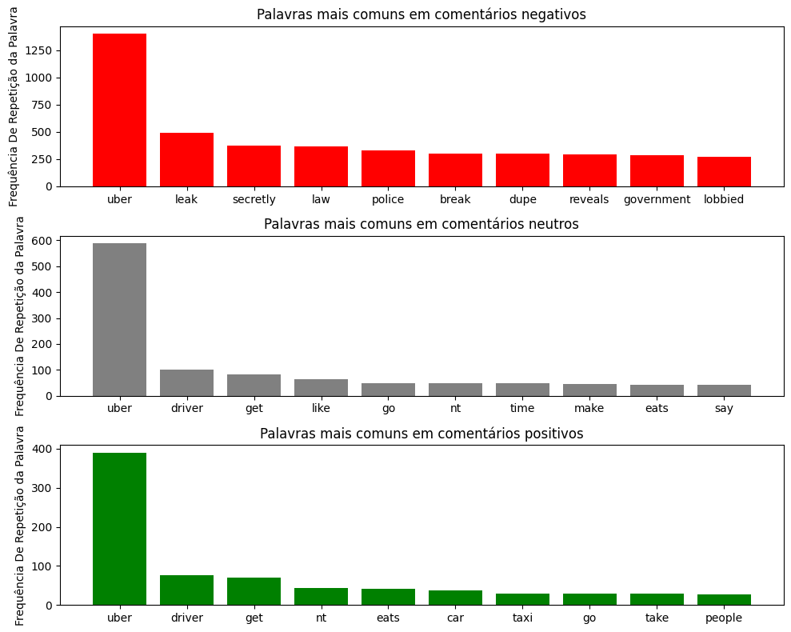 <br>
  Fonte: Elaborado pelos autores <br>
</p>

&emsp;&emsp; Em comparação ao gráfico gerado antes do pré-processamento, em que havia majoritariamente a presença de stopwords, agora nota-se a presença de palavras que de fato podem contribuir para o modelo de <i>machine learning</i>. Com esse gráfico é possível notar também que "uber" é a palavras mais frequente em todas as classes do <i>Dataset</i>, levando a entender que os comentário estão, em sua maioria, ligados a marca em si e não apenas a um produto específico, fato que pode contribuir para que o modelo seja mais preciso em identiifcar ataques de marca.

---

<p align="center">
  Figura 36 - Correlação entre o Comprimento do Comentário e o Sentimento pós pré-processamento <br>
  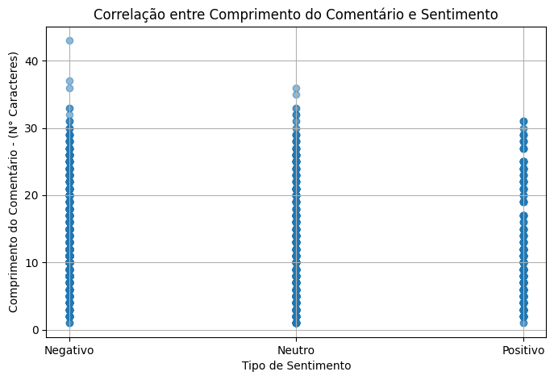 <br>
  Fonte: Elaborado pelos autores <br>
</p>

&emsp;&emsp; O gráfico da correlação entre o comprimento e o sentimento do comentário contribuiu para validar a hipótese de que comentários negativos tendem a ser maiores que os demais, mesmo após a etapa de pré-processamento. Essa correlação entre comprimento e sentimento do comentário pode virar uma nova dimensão vetorial do modelo, contribuindo ainda mais para a identificação de comentários negativos, caso essa hipótese permaneça verídica em novos testes.

---

<p align="center">
  Figura 37 - Média do Comprimento dos Comentários por Sentimento pós pré-processamento<br>
  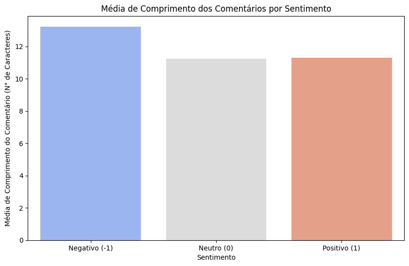 <br>
  Fonte: Elaborado pelos autores <br>
</p>

&emsp;&emsp; O gráfico da média de comprimento e o sentimento do comentário, assim como o gráfico de correlação, contribuiu para validar a hipótese de que comentários negativos tendem a ser maiores que os demais, mesmo após a etapa de pré-processamento. Essa correlação entre comprimento e sentimento do comentário pode virar uma nova dimensão vetorial do modelo, contribuindo ainda mais para a identificação de comentários negativos, caso essa hipótese permaneça verídica em novos testes que realizarmos.


## 3.3	Documentação do BoW

### 3.3.1	Introdução

<p align="justify">
&emsp;&emsp;A análise de sentimentos é uma área de estudo no campo do processamento de linguagem natural (NLP), envolvendo a classificação das emoções expressas em textos escritos. À medida que interações digitais se tornam cada vez mais comuns, compreender os sentimentos expressos em comentários de usuários torna-se essencial para diversas aplicações, desde o monitoramento de feedback de clientes até a moderação de conteúdo em plataformas online. Este projeto visa explorar e otimizar a construção de um modelo de análise de sentimentos utilizando o método Bag of Words (BoW), uma técnica fundamental no NLP que converte texto em uma representação numérica, permitindo seu processamento por algoritmos de aprendizado de máquina. Através deste trabalho, buscamos desenvolver, implementar e comparar diferentes abordagens de BoW, avaliando sua eficácia em capturar nuances linguísticas e melhorar a precisão da classificação de sentimentos em dados textuais complexos. [8] </p>

### 3.3.2	Descrição função manual
<p align="justify"> 
&emsp;&emsp;A função `manual_bow` é projetada para construir manualmente uma matriz Bag of Words a partir de uma lista de documentos, onde cada documento é representado como uma lista de palavras (tokens). O processo de implementação envolve várias etapas que contribuem para a sua funcionalidade e precisão.</p>

<p align="justify"> 
&emsp;&emsp;O vocabulário é construído como um conjunto de todas as palavras únicas presentes em todos os documentos fornecidos. Isso garante que cada palavra única seja considerada apenas uma vez. O conjunto de palavras é então transformado em uma lista ordenada, que serve como o vocabulário da matriz BoW. A ordenação do vocabulário é importante, pois define um índice consistente para cada palavra ao longo de toda a matriz.</p>

<p align="justify"> 
&emsp;&emsp;Para cada palavra no vocabulário ordenado, é atribuído um índice único, que é armazenado em um dicionário chamado `word_index`. Este dicionário mapeia cada palavra a um índice específico, facilitando a localização da posição de cada palavra na matriz BoW durante a construção.</p>

<p align="justify"> 
&emsp;&emsp;Para cada documento na lista de entrada, é inicializado um vetor de zeros com tamanho igual ao do vocabulário. Cada palavra no documento é processada, e o contador correspondente no vetor é incrementado sempre que uma palavra do documento é encontrada no vocabulário. Isso é feito utilizando o índice da palavra armazenado em `word_index`. O vetor gerado representa a frequência de cada palavra do vocabulário no documento e é adicionado à matriz BoW como uma nova linha.</p>

#### Vantagens e Limitações:
- **Vantagens:**
  - **Controle completo:** Oferece controle total sobre o processo de vetorização, permitindo personalizações específicas no pré-processamento de texto.
  - **Transparência:** A implementação manual torna o processo transparente e facilmente auditável para erros ou melhorias.

- **Limitações:**
  - **Eficiência:** Pode ser menos eficiente em comparação com implementações otimizadas encontradas em bibliotecas como `scikit-learn`.
  - **Escalabilidade:** Pode não ser adequada para grandes volumes de dados devido à sua natureza iterativa e ao uso intensivo de recursos.

<p align="justify"> 
&emsp;&emsp;Essa abordagem manual é útil em contextos educacionais, onde se deseja ter um profundo entendimento do passo a passo ou em projetos onde ajustes precisos no processamento de texto são necessários.</p>

### 3.3.3	Descrição biblioteca Sklearn - Padrão
<p align="justify"> 
&emsp;&emsp;A função `sklearn_bow` é uma implementação da construção de uma matriz Bag of Words (BoW) utilizando o `CountVectorizer` padrão da biblioteca `scikit-learn`. Esta função é projetada para processar uma lista de documentos, onde cada documento é inicialmente uma lista de palavras (tokens), e os converte em uma matriz BoW padronizada e eficiente.</p>

<p align="justify"> 
&emsp;&emsp;Antes de vetorizar os documentos, cada documento, que é uma lista de tokens, é convertido de volta para uma string. Isso é necessário porque o `CountVectorizer` espera strings como entrada e não listas de tokens. A conversão é feita juntando cada lista de palavras (tokens) em uma única string, onde cada palavra é separada por um espaço.</p>

<p align="justify"> 
&emsp;&emsp;O `CountVectorizer` é inicializado com suas configurações padrão. Este vetorizador é responsável por converter o texto dos documentos em uma matriz de características de frequência de termos. Ele automaticamente realiza a tokenização e contagem de frequência de palavras, simplificando o processo de vetorização.</p>

<p align="justify"> 
&emsp;&emsp;O `CountVectorizer` é ajustado aos documentos preparados e, em seguida, transforma esses documentos em uma matriz BoW. Esta matriz é uma representação numérica onde cada linha corresponde a um documento e cada coluna a uma palavra no vocabulário, com os valores representando a frequência da palavra correspondente no documento.</p>

<p align="justify"> 
&emsp;&emsp;Após a vetorização, o vocabulário, que é o conjunto de todas as palavras únicas encontradas nos documentos, é extraído e ordenado alfabeticamente. Este vocabulário pode ser acessado através do método `get_feature_names_out()`, que retorna uma lista das palavras ordenadas.</p>

#### Vantagens e Limitações:
- **Vantagens:**
  - **Eficiência:** O `CountVectorizer` é otimizado para processar grandes volumes de texto rapidamente.
  - **Facilidade de uso:** Simplifica o processo de vetorização ao abstrair a necessidade de manipulações manuais de tokens e contagem.
  - **Integração com ML:** Facilmente integrável com outros componentes do `scikit-learn` para pipelines de <i>machine learning</i>.

- **Limitações:**
  - **Flexibilidade:** Menos flexível em termos de personalização específica do pré-processamento, como tokenização especializada ou filtros de stopwords personalizados.

<p align="justify"> 
&emsp;&emsp;Esta função é uma ótima opção para projetos que requerem uma implementação rápida e eficiente de processamento de texto, especialmente em situações onde o volume de dados é substancial e a integração com outras tarefas de aprendizado de máquina é necessária, como o projeto atual.</p>

### 3.3.4	Descrição biblioteca keras

<p align="justify"> 
&emsp;&emsp;A função `generate_bow_from_tokenized_docs` é uma implementação para a criação de uma matriz Bag of Words (BoW) utilizando o `Tokenizer` do Keras, uma ferramenta do TensorFlow voltada para o processamento de texto em projetos de deep learning. Esta função processa uma lista de documentos onde cada documento já está tokenizado, e os converte em uma matriz BoW junto com o vocabulário associado.</p>

<p align="justify"> 
&emsp;&emsp;Cada documento fornecido como uma lista de tokens é convertido de volta para uma string, pois o `Tokenizer` do Keras espera strings para processamento. A conversão é feita juntando os tokens com espaços, formando frases completas.</p>

<p align="justify"> 
&emsp;&emsp;O `Tokenizer` é inicializado sem parâmetros específicos, o que permite que ele processe o número total de palavras encontradas nos documentos. Ele é responsável por criar o vocabulário e converter o texto em uma matriz numérica.</p>

<p align="justify"> 
&emsp;&emsp;O `Tokenizer` é ajustado aos textos processados para construir o vocabulário, mapeando cada palavra única a um índice inteiro. Esta etapa é importante para a vetorização subsequente dos documentos.</p>

<p align="justify"> 
&emsp;&emsp;Após construir o vocabulário, a função `texts_to_matrix` do `Tokenizer` é utilizada para transformar os textos em uma matriz BoW. Esta matriz é construída usando o modo 'count', que contabiliza a frequência de cada palavra nos documentos.</p>

<p align="justify"> 
&emsp;&emsp;O vocabulário gerado é extraído e ordenado pelo índice de cada palavra. Isso facilita a identificação e o uso das palavras no contexto de outras operações de processamento ou modelagem de dados.</p>

#### Vantagens e Limitações:
- **Vantagens:**
  - **Integração com deep learning:** Bem integrável com modelos de deep learning no ecossistema do TensorFlow/Keras.
  - **Flexibilidade:** Oferece várias opções para a geração da matriz, incluindo modos como frequência, binário, tf, e tf-idf.
  - **Automatização:** Simplifica a construção do vocabulário e a vetorização, facilitando o pipeline de desenvolvimento.

- **Limitações:**
  - **Complexidade para tarefas simples:** Pode ser complexo para tarefas simples de vetorização onde modelos mais simples poderiam ser suficientes.
  - **Dependência de TensorFlow:** Restrito ao uso dentro do ecossistema TensorFlow, o que pode não ser ideal para projetos que utilizam outras bibliotecas de <i>machine learning</i>.

<p align="justify"> 
&emsp;&emsp;Esta função é ideal para projetos que se beneficiam da integração direta com processos de deep learning, oferecendo um método completo e flexível para a preparação de dados textuais.</p>

### 3.3.5 Descrição biblioteca Sklearn - Tdifd

<p align="justify"> 
&emsp;&emsp;A função `sklearn_tfidf` é uma implementação para construir uma matriz TF-IDF (Term Frequency-Inverse Document Frequency) usando o `TfidfVectorizer` do scikit-learn. Este método é utilizado em análises de texto para avaliar a importância de uma palavra em um conjunto de documentos, considerando não apenas a frequência da palavra no documento, mas também sua raridade em toda a coleção de documentos.</p>

<p align="justify"> 
&emsp;&emsp;Assim como nas outras funções de vetorização, os documentos, inicialmente em formato de listas de tokens, são convertidos de volta para strings. Cada documento é transformado em uma string única com palavras separadas por espaços, preparando-os para o processamento pelo vetorizador.</p>

<p align="justify"> 
&emsp;&emsp;O `TfidfVectorizer` é inicializado com configurações padrão. Este vetorizador é projetado para converter texto em uma matriz de características TF-IDF, oferecendo uma representação mais rica que leva em conta a frequência de termos dentro de um documento e sua frequência inversa nos documentos do corpus, destacando palavras significativas que são raras nos documentos.</p>

<p align="justify"> 
&emsp;&emsp;O vetorizador é ajustado aos documentos preparados e, em seguida, transforma esses documentos em uma matriz TF-IDF. Cada elemento da matriz representa o peso TF-IDF de um termo em um documento, o que ajuda a diferenciar os termos que são mais importantes para o conteúdo de um documento.</p>

<p align="justify"> 
&emsp;&emsp;O vocabulário construído é extraído e ordenado alfabeticamente, acessível através do método `get_feature_names_out()`. Esse vocabulário lista todas as palavras únicas encontradas nos documentos, ordenadas por seus índices na matriz.</p>

#### Vantagens e Limitações:
- **Vantagens:**
  - **Relevância de termos:** Fornecer uma medida ponderada que destaca termos mais informativos dentro dos documentos.
  - **Facilidade de uso:** Integra-se facilmente com outros componentes de <i>machine learning</i> do scikit-learn.
  - **Eficiência:** Altamente otimizado para lidar com grandes conjuntos de dados e complexidade computacional.

- **Limitações:**
  - **Sensibilidade a documentos pequenos:** Pode ser menos eficaz em corpora muito pequenos ou com documentos muito curtos onde a frequência inversa dos documentos não é tão impactante.

<p align="justify"> 
&emsp;&emsp;Esta função é especialmente útil em contextos onde a relevância das palavras em relação ao conjunto de documentos é crucial, como na filtragem de informações, recuperação de documentos e modelagem de tópicos.</p>

### 3.3.6 Descrição biblioteca Sklearn - Bigrams

<p align="justify"> 
&emsp;&emsp;A função `sklearn_bow_bigrams` é uma implementação para construir uma matriz Bag of Words (BoW) usando o `CountVectorizer` do scikit-learn, especificamente configurado para incluir bigramas. Esta abordagem permite capturar mais contexto ao considerar combinações de duas palavras consecutivas, além dos unigramas comuns.</p>

<p align="justify"> 
&emsp;&emsp;Os documentos, inicialmente fornecidos como listas de tokens, são convertidos de volta para strings. Cada documento é transformado em uma única string com palavras separadas por espaços. Esta etapa prepara os documentos para o processamento pelo vetorizador.</p>

<p align="justify"> 
&emsp;&emsp;O `CountVectorizer` é configurado para usar um intervalo de n-gramas de 1 a 4, o que significa que ele irá considerar unigramas, bigramas, trigramas e quadrigramas. Esta configuração amplia  a capacidade de capturar nuances linguísticas e relações entre as palavras em cada documento.</p>

<p align="justify"> 
&emsp;&emsp;O vetorizador é ajustado aos documentos convertidos e, em seguida, transforma esses documentos em uma matriz BoW. Esta matriz contém a contagem de cada unigrama, bigrama, trigrama e quadrigrama presente nos documentos, oferecendo uma representação detalhada do texto.</p>

<p align="justify"> 
&emsp;&emsp;Após a vetorização, o vocabulário construído é extraído e listado em ordem alfabética através do método `get_feature_names_out()`. Esse vocabulário inclui não apenas palavras individuais, mas também combinações de palavras, permitindo uma análise mais profunda do conteúdo textual.</p>

#### Vantagens e Limitações:
- **Vantagens:**
  - **Análise de contexto:** Capaz de identificar relações e contextos mais complexos entre palavras.
  - **Flexibilidade:** Permite uma análise textual mais detalhada, ideal para aplicações como análise de sentimento ou classificação de documentos onde o contexto é crucial.
  - **Eficiência e Integração:** Eficiente e facilmente integrável com outras ferramentas de <i>machine learning</i> no ecossistema scikit-learn.

- **Limitações:**
  - **Complexidade e Dimensionalidade:** A inclusão de múltiplos n-gramas aumenta significativamente a dimensionalidade da matriz BoW, o que pode levar a desafios relacionados ao processamento e à memória, especialmente com grandes conjuntos de dados.

<p align="justify"> 
&emsp;&emsp;Esta função é especialmente útil em contextos onde a compreensão detalhada do texto é necessária, oferecendo <i>insights</i> mais profundos sobre a estrutura e o uso da linguagem nos documentos analisados.</p>

### 3.3.6	Descrição das comparações

<p align="justify"> 
&emsp;&emsp;Para a comparação dos modelos BoW (Bag of Words) realizados, considerasse alguns critérios de avaliação comuns. Dentre esses critérios foram selecionados: a completude do vocabulário, a densidade da matriz, a facilidade de implementação e uso e a integração com outras ferramentas de processamento de dados e aprendizado de máquina.</p>

1. Completude do vocabulário:
    * Manual:  O vocabulário pode não incluir todas as palavras que um "CountVectorizer" ou "Tokenizer" do keras poderia extrair devido a diferenças na forma como tokens são contados ou até mesmo filtrados.
    * Sklearn: O "CountVectorizer" é mais robusto e trata de muitos aspectos do pré-processamento de texto, garantindo um vocabulário mais completo.
    * Keras: Similar ao sklearn, o "Tokenizer" da biblioteca keras é eficaz para extrair um vocabulário abrangente e acaba sendo ainda mais útil se o próximo passo envolver modelagem de deep learning.
    * Sklearn (Bigramas): Captura mais contexto ao incluir combinações de palavras adjacentes, aumentando a completude e relevância do vocabulário.
    * Sklearn (TF-IDF): Além de capturar o vocabulário, pondera as palavras pela sua raridade nos documentos, o que pode revelar termos distintivamente significativos.
2. Densidade da matriz:
    * Manual: Tende a produzir uma matriz com mais zeros, especialmente se o pré-processamento não é tão completo quanto os métodos automáticos.
    * Sklearn e Keras: Geralmente eles acabam produzindo matrizes mais semelhantes em termos de densidade, mas isso pode variar dependendo do pré-processamento aplicado antes da vetorização.
3. Facilidade de implementação e uso:
    * Manual: Requer mais código e cuidado para garantir que os aspectos sejam realizados corretamente.
    * Sklearn: Maior facilidade de usar e integrar com pipelines de <i>machine learning</i> existentes em Python, pela existência do ecossistema scikit-learn.
    * Keras: Também apresenta maior facilidade de uso, especialmente se integrado com modelos de deep learning, mas pode ser um pouco excessivo para tarefas simples de vetorização de texto, acaba sendo mais lento para se processar.
4. Integração com ferramentas de <i>Machine Learning</i>:
    * Manual: Pode ser menos compatível com algumas ferramentas avançadas de <i>machine learning</i> se não houver um trabalho adicional.
    * Sklearn: Ótima integração com outras ferramentas de <i>machine learning</i> em Python.
    * Keras: Ótima escolha se o projeto for evoluir para utilizar redes neurais e deep learning.

### 3.3.7 Conclusão

<p align="justify">
&emsp;&emsp;Após uma análise detalhada e comparação das diferentes abordagens para implementação do modelo Bag of Words (BoW), observou-se que cada método tem suas vantagens específicas, dependendo do contexto e dos requisitos do projeto. Entretanto, para o nosso projeto específico, que envolve análises de sentimentos e classificação de texto, a escolha do modelo BoW com bigramas utilizando o `sklearn` provou ser a mais eficaz. Esta abordagem não só mantém a simplicidade e a robustez características do `sklearn`, mas também adiciona uma camada adicional de contexto ao considerar bigramas, o que é importante para capturar nuances linguísticas importantes em tarefas de processamento de linguagem natural (NLP).</p>

<p align="justify">
&emsp;&emsp;A capacidade do modelo com bigramas de capturar relações mais complexas entre palavras oferece uma vantagem significativa sobre os modelos de unigramas, melhorando assim a qualidade da análise de sentimentos e a precisão da classificação de texto. Além disso, a integração eficiente com o ecossistema de aprendizado de máquina do Python permite uma implementação rápida e eficaz de pipelines de NLP, facilitando a experimentação e a iteração.</p>

<p align="justify">
&emsp;&emsp;Embora a construção manual do BoW forneça um excelente entendimento fundamental das operações envolvidas, a eficiência e a escalabilidade do `sklearn` com bigramas tornam-no ideal para atender às demandas de grandes volumes de dados e requisitos complexos de processamento, posicionando-o como a escolha preferencial para avançar neste projeto.</p>

## 3.4 Modelos _Machine Learning_

<p align="justify">
&emsp;&emsp;No contexto deste projeto, aplicamos dois modelos de <i>machine learning</i> distintos para analisar e classificar sentimentos expressos em avaliações de usuários sobre o Uber: Naive Bayes e SVM (Support Vector Machine). O Naive Bayes é conhecido por sua base probabilística e simplicidade, sendo eficaz especialmente em dados textuais onde a independência entre as características (palavras) pode ser uma suposição razoável, apesar de sua simplicidade. Por outro lado, o SVM é aplicado devido à sua capacidade de criar uma fronteira de decisão ótima entre diferentes classes, o que é particularmente útil em conjuntos de dados onde a distinção entre categorias de sentimentos é mais sutil. [9]</p>

### 3.4.1 Resultados _Naive Bayes_

<p align="justify">
&emsp;&emsp;A seguir estão os resultados obtidos pelo modelo Naive Bayes na tarefa de classificação dos sentimentos das avaliações dos usuários do Uber. A tabela resume as métricas de precisão, recall e pontuação F1 para cada categoria de sentimento analisada:</p>

| Sentimento  | Precisão | Recall | F1-Score |
|-------------|----------|--------|----------|
| Negativo    | 0.89     | 0.69   | 0.77     |
| Neutro      | 0.56     | 0.42   | 0.48     |
| Positivo    | 0.42     | 0.93   | 0.58     |
| **Acurácia Geral** | **-**      | **-**    | **0.65** |

### 3.4.2 Resultados SVM

<p align="justify">
&emsp;&emsp;Os resultados do modelo SVM, que utiliza uma técnica de fronteira linear para classificar os sentimentos, são apresentados na tabela abaixo. As métricas incluem precisão, recall e F1-Score para cada tipo de sentimento:</p>

| Sentimento  | Precisão | Recall | F1-Score |
|-------------|----------|--------|----------|
| Negativo    | 0.90     | 0.74   | 0.81     |
| Neutro      | 0.58     | 0.79   | 0.67     |
| Positivo    | 0.81     | 0.78   | 0.79     |
| **Acurácia Geral** | **-**      | **-**    | **0.76** |

### 3.4.3 Conclusão

<p align="justify">
&emsp;&emsp;O modelo SVM Linear, aplicando a técnica de bigrams no processo de BoW, demonstrou ser mais eficaz para a análise de sentimentos das avaliações do Uber, alcançando uma precisão geral de 76.43% com resultados sólidos em todas as categorias de sentimentos. Este modelo superou o Naive Bayes, particularmente na classificação de comentários neutros e positivos, como pode ser observado pelas métricas de recall e precisão mais equilibradas. Continuaremos a refinar o modelo para melhorar sua precisão e capacidade de generalização, visando aprimorar ainda mais a eficácia em identificar corretamente os sentimentos nas avaliações.</p>

## 3.6 Documentação do Word2Vec

### 3.6.1 Introdução
Na análise de sentimentos do projeto Uber, empregamos o modelo Word2Vec, uma técnica de processamento de linguagem natural que transforma palavras em vetores numéricos densos. Este modelo é essencial para capturar as nuances semânticas das interações dos usuários, permitindo uma análise mais profunda e a identificação de padrões em textos extensos. Aqui, discutiremos em detalhes o corpus utilizado, as configurações e parâmetros para o treinamento do Word2Vec, e como os vetores gerados são aplicados para classificar os sentimentos expressos nos comentários. O objetivo desta documentação é fornecer uma visão compreensiva sobre como o Word2Vec contribui para a precisão e eficácia da análise de sentimentos no contexto do nosso projeto.

### 3.6.2 Descrição do desenvolvimento do Word2Vec (CBoW) feito no notebook
No âmbito do projeto, empregamos a técnica Continuous Bag of Words (CBoW) para desenvolver o modelo Word2Vec, visando aprimorar a análise de sentimentos dos comentários sobre a Uber. A escolha dessa abordagem foi direcionada pela sua eficácia em produzir representações vetoriais de palavras que refletem seu contexto semântico, facilitando assim a identificação e classificação de sentimentos como positivos, negativos ou neutros.
rição do desenvolvimento do Word2Vec (CBoW) feito no notebook

**Importação e Pré-processamento de Dados**  
Inicialmente, realizamos a importação dos dados necessários juntamente com as bibliotecas necessárias. A análise exploratória inicial focou na distribuição dos sentimentos, frequência de palavras-chave, e na correlação entre o comprimento dos comentários e os sentimentos expressos. O pré-processamento foi uma etapa importante que incluiu a tokenização para segmentar o texto em palavras, lematização para reduzir as palavras a suas formas base considerando o contexto gramatical, e a remoção de pontuações, números, stopwords e links. Esse processamento foi fundamental para limpar e normalizar os dados, preparando-os para o treinamento eficaz do modelo.

**Treinamento do Modelo Word2Vec (CBoW)**  
Com os dados devidamente preparados, procedemos ao treinamento do modelo Word2Vec usando a abordagem CBoW através da biblioteca gensim. Neste método, o modelo foi configurado para prever palavras com base no contexto circundante, uma técnica que se mostrou eficaz para compreender o significado contextual das palavras. O treinamento foi ajustado com parâmetros específicos como tamanho do vetor, janela de contexto e número mínimo de ocorrências da palavra, que foram otimizados para melhor capturar as características linguísticas dos comentários.

**Utilização de Vetores Pré-treinados**  
Para assegurar a robustez de nosso modelo, integramos vetores pré-treinados do Google News como uma camada adicional de validação. Essa integração permitiu comparar a eficácia dos vetores gerados pelo nosso modelo com aqueles criados a partir de um conjunto de dados extensivo e diversificado. Testamos a similaridade entre palavras comuns nos comentários e avaliamos se o modelo estava capturando as relações semânticas corretas, o que se mostrou uma prática valiosa para confirmar a acurácia do nosso sistema.

**Exportação do Modelo**  
Após a fase de treinamento e validação, o modelo Word2Vec foi exportado em formato compatível para uso futuro. Isso permite a reutilização eficiente do modelo em processos contínuos de análise ou em projetos similares, garantindo que os insights obtidos sejam preservados e facilmente acessíveis.

Em resumo, a implementação do modelo Word2Vec CBoW no projeto Moodfy evidenciou a capacidade desta tecnologia em enriquecer a análise de sentimentos, provendo uma base sólida para interpretações precisas e detalhadas das opiniões dos usuários da Uber.

### 3.6.3 Descrição do desenvolvimento do Word2Vec (Skip-gram) feito no notebook
No projeto, o modelo Word2Vec Skip-gram foi adotado com o objetivo de capturar de forma mais detalhada o contexto semântico das palavras nos comentários sobre a Uber. A metodologia Skip-gram é eficaz para tratar de datasets menores, pois foca em prever o contexto a partir de palavras específicas, o que ajuda a capturar nuances semânticas até mesmo em palavras menos frequentes no corpus.

**Importação e Pré-processamento de Dados**  
Assim como na abordagem CBoW, iniciamos com a importação dos dados necessários e das bibliotecas correspondentes. Uma análise exploratória foi conduzida para obter uma visão geral da distribuição dos sentimentos e das palavras mais comuns. Durante o pré-processamento, o texto foi submetido a tokenização, lematização, e remoção de elementos como pontuações, números, stopwords e links, preparando os dados para um tratamento analítico mais eficiente.

**Treinamento do Modelo Word2Vec (Skip-gram)**  
Após preparar o dataset, procedemos ao treinamento do modelo Word2Vec utilizando a abordagem Skip-gram, que diferencia-se do CBoW ao focar em utilizar uma palavra central para prever as palavras em seu contexto. Este método é vantajoso especialmente para aprender representações profundas de palavras menos frequentes, o que pode ser crucial para identificar sentimentos específicos expressos em comentários. Os parâmetros do modelo, como tamanho do vetor, janela de contexto e número mínimo de ocorrências, foram cuidadosamente ajustados para otimizar o aprendizado.

**Utilização de Vetores Pré-treinados**  
Para validar a eficácia do modelo Skip-gram treinado, utilizamos uma comparação com vetores pré-treinados disponíveis publicamente, como os do Google News. Isso nos permitiu verificar se os vetores de palavras gerados refletiam as relações semânticas esperadas e se estavam alinhados com padrões reconhecidos de uso linguístico. Avaliamos a similaridade entre termos-chave para garantir que o modelo compreendia suas relações semânticas de maneira adequada.

**Exportação do Modelo**  
Após a fase de treinamento e as devidas validações, o modelo treinado foi salvo em formato binário para facilitar a reutilização em análises futuras ou integração com outros sistemas de processamento de linguagem natural. A exportação do modelo é uma etapa crucial que garante a persistência do conhecimento adquirido e a facilidade de acesso para aplicações subsequentes.

Em resumo, a implementação do modelo Word2Vec Skip-gram no projeto mostrou-se uma estratégia para analisar detalhadamente o conteúdo emocional e semântico dos comentários dos usuários, fornecendo insights relevantes para a classificação de sentimentos e outras análises relacionadas.

### 3.6.4 Resultados e Análise dos Testes Word2Vec com CBOW vs Skip-gram
**Desempenho dos Modelos**

**Word2Vec com Dados Pré-processados:** Os modelos treinados com dados pré-processados (tokenizados e limpos) apresentaram melhor desempenho em comparação com os dados não processados.

**Vetores Pré-treinados vs. Dados da Base:** Modelos que utilizaram vetores pré-treinados como ponto de partida superaram aqueles treinados apenas com nossa base de dados, devido à limitação da quantidade de dados disponíveis.

**CBOW vs. Skip-gram:** Ambos os modelos apresentaram bons resultados. No entanto, o Skip-gram mostrou uma similaridade maior entre "like" e "hate", o que é justificado pelo mesmo ter sido treinado com nossa base de dados, que é limitada, enquanto o CBOW utiliza os vetores pré-treinados da Google.

**Possíveis Razões**

**Contexto Semântico nos Dados:** No treinamento do Skip-gram, o modelo aprende a prever palavras baseadas em seu contexto. Se "like" e "hate" aparecem frequentemente em contextos semelhantes, como em frases que expressam sentimentos fortes ou opiniões, o modelo pode aprender a associar essas palavras de forma similar.

**Tamanho e Diversidade do Corpus:** Se o corpus é pequeno ou não suficientemente diversificado, o modelo pode não capturar corretamente as nuances semânticas entre palavras que têm significados opostos. Nosso corpus é relativamente pequeno e naturalmente enviesado, a maior classe é a negativa, e a base foi retirada em apenas um dia e localidade (em um contexto, na época, problemático para a empresa).

**Pré-processamento dos Dados:** A maneira como os dados foram pré-processados pode afetar os resultados. Por exemplo, se remoções de stop words ou outros filtros não foram aplicados corretamente, isso pode impactar a qualidade dos vetores de palavras gerados.

**Número de Épocas de Treinamento:** Overfitting pode ocorrer se o modelo for treinado por muitas épocas, fazendo com que ele memorize o corpus em vez de generalizar adequadamente.

**Conclusão**

**Similaridade Calculada:** Inicialmente, a similaridade entre "like" e "hate" parecia contra-intuitivamente alta (0.9125). Essa similaridade alta pode ser atribuída ao contexto em que essas palavras aparecem no corpus, mas também é justificada pelo treinamento do Skip-gram, feito com nosso dataset.

**Visualização dos Vetores:** A projeção dos vetores de palavras para um espaço bidimensional usando PCA mostrou que "like" e "hate" estão, na verdade, relativamente distantes no espaço vetorial. Isso sugere que, apesar da alta similaridade numérica, essas palavras ocupam regiões distintas no espaço de vetores, refletindo sua diferença semântica. "Love" está também distante de "hate", como esperado, dado que são palavras opostas.

**Influência do Contexto Semântico:** A proximidade das palavras no espaço vetorial bidimensional pode ser influenciada pela maneira como elas são usadas no corpus. "Like" e "love" estão mais próximos um do outro, o que é intuitivo, já que ambas expressam sentimentos positivos. A alta similaridade calculada entre "like" e "hate" sugere a necessidade de, futuramente, revisar e possivelmente ampliar o corpus para melhor capturar as nuances semânticas.

**Importância do Pré-processamento e Parâmetros:** Os resultados destacam a importância de um pré-processamento cuidadoso dos dados e a escolha adequada dos parâmetros do modelo. Variações nesses fatores podem afetar significativamente os vetores de palavras gerados e suas similaridades.

### 3.6.5 Resultados dos Modelos (Naive Bayes e SVM)
Nesta seção, apresentamos os resultados obtidos a partir da aplicação dos modelos Naive Bayes e SVM na classificação de sentimentos dos comentários dos usuários da Uber. Utilizamos diferentes abordagens de pré-processamento e vetorização de texto para treinar e avaliar esses modelos, buscando identificar a configuração que proporcionasse a melhor performance.

**Naive Bayes**  
O modelo Naive Bayes foi escolhido por sua simplicidade e eficácia em tarefas de classificação de texto. A seguir estão os passos e resultados obtidos:

**Treinamento e Avaliação:**

- O modelo foi treinado utilizando os vetores de palavras gerados pelo método Word2Vec (CBOW e Skip-gram).
- Para a avaliação, utilizamos métricas como precisão, recall e F1-score para cada classe de sentimento (positivo, negativo e neutro).

**Resultados:**

- O modelo Naive Bayes apresentou uma precisão média de aproximadamente 0.72 no conjunto de teste.
- Apesar de ser eficiente, o modelo teve dificuldades em diferenciar sentimentos neutros de negativos, devido à natureza simplista do algoritmo que assume independência entre as palavras.

**Support Vector Machine (SVM)**  
O modelo SVM foi utilizado por sua capacidade de encontrar a melhor fronteira de decisão entre diferentes classes de sentimentos. Realizamos uma busca em grade (Grid Search) para encontrar os melhores hiperparâmetros, conforme mostrado na imagem acima. Os melhores hiperparâmetros encontrados foram:

- 'C': 10
- 'degree': 2
- 'gamma': 'scale'
- 'kernel': 'sigmoid'

**Treinamento e Avaliação:**

- O modelo SVM foi treinado com os mesmos vetores de palavras usados no Naive Bayes.
- O Grid Search ajudou a otimizar os hiperparâmetros do SVM, resultando em uma melhor performance.

**Resultados:**

- O modelo SVM alcançou uma precisão de 0.7665 no conjunto de teste.
- Comparado ao Naive Bayes, o SVM foi mais eficaz em capturar a complexidade dos dados, diferenciando melhor entre as classes de sentimentos.
- A busca em grade mostrou que o kernel sigmoid, com C=10 e gamma='scale', ofereceu a melhor combinação de parâmetros para maximizar a precisão do modelo.

Em conclusão, o modelo SVM, utilizando a técnica de vetorização Word2Vec e otimizado por meio de Grid Search, demonstrou ser mais eficaz na análise de sentimentos dos comentários dos usuários da Uber. Sua precisão superior e capacidade de capturar nuances nos dados justificam sua utilização para análises futuras. O Naive Bayes, embora menos preciso, ainda se mostrou um modelo válido para classificações rápidas e menos complexas.

### 3.6.6 Comparação entre os Modelos CBoW e Skip-gram
No contexto da análise de sentimentos em nosso projeto Moodfy, utilizamos duas abordagens distintas para o treinamento do modelo Word2Vec: Continuous Bag of Words (CBoW) e Skip-gram. Ambas as abordagens têm suas próprias vantagens e desvantagens, sendo escolhidas com base nas necessidades específicas de nossa análise de sentimentos. Abaixo está uma comparação detalhada entre essas duas abordagens, destacando suas características e aplicações no projeto.

**Continuous Bag of Words (CBoW)**  
O modelo CBoW é projetado para prever uma palavra alvo (central) com base no contexto das palavras ao seu redor. Essa abordagem é mais eficiente em termos de tempo de treinamento e recursos computacionais, o que a torna adequada para trabalhar com grandes conjuntos de dados. No projeto Moodfy, o CBoW foi utilizado principalmente para capturar sentimentos gerais presentes nos comentários dos usuários da Uber. A eficiência do CBoW permitiu a rápida construção de um modelo funcional que poderia ser utilizado para análises em larga escala.

**Vantagens:**

- Treinamento mais rápido e eficiente em termos de recursos computacionais.
- Adequado para grandes volumes de dados, permitindo a análise de sentimentos de forma abrangente.

**Desvantagens:**

- Pode não capturar bem as relações semânticas de palavras raras.
- Foca mais em palavras comuns, podendo perder nuances presentes em palavras menos frequentes.

**Skip-gram**  
Por outro lado, o modelo Skip-gram faz o oposto do CBoW, prevendo palavras de contexto com base em uma palavra alvo. Esta abordagem é particularmente eficaz para capturar relações semânticas de palavras raras, tornando-a ideal para análises mais detalhadas e precisas. No projeto Moodfy, o Skip-gram foi empregado para obter uma compreensão mais profunda dos comentários dos usuários, especialmente para identificar sentimentos específicos que poderiam ser perdidos pelo CBoW.

**Vantagens:**

- Captura melhor as relações semânticas de palavras raras.
- Gera vetores de palavras mais precisos, especialmente para palavras menos frequentes.

**Desvantagens:**

- Treinamento mais lento e computacionalmente mais caro.
- Pode ser excessivo para grandes corpora, onde a precisão do contexto é mais importante.

**Comparação dos Resultados**  
Ao comparar os resultados obtidos pelos modelos CBoW e Skip-gram, notamos que o Skip-gram tendia a fornecer vetores de palavras mais precisos para palavras raras, o que é crucial para identificar sentimentos negativos específicos. No entanto, o CBoW mostrou-se mais eficiente para a análise geral de grandes volumes de dados, proporcionando uma visão abrangente dos sentimentos expressos nos comentários.

- **Precisão:** O Skip-gram apresentou uma precisão superior na captura de nuances em palavras raras, enquanto o CBoW foi eficiente para análise de sentimentos gerais.
- **Eficiência:** O CBoW foi significativamente mais rápido e menos intensivo em termos de recursos computacionais, sendo mais adequado para processamento de grandes volumes de dados.
- **Ajuste ao Contexto:** Ambos os modelos foram ajustados para nosso corpus específico, mas o Skip-gram demonstrou-se mais eficaz em contextos menos frequentes e palavras raras.

A escolha entre CBoW e Skip-gram depende do objetivo específico da análise. Para nosso projeto, a combinação de ambos os modelos permitiu uma análise de sentimentos tanto abrangente quanto detalhada, beneficiando-se da eficiência do CBoW para processamento de grandes volumes de dados e da precisão do Skip-gram para contextos mais específicos e palavras raras.

### 3.6.7 Conclusão
Nesta seção do projeto, exploramos e implementamos diferentes abordagens de Word2Vec, utilizando tanto o Continuous Bag of Words (CBoW) quanto o Skip-gram, para analisar e classificar sentimentos em comentários de usuários da Uber. Através da aplicação cuidadosa de pré-processamento de dados, treinamento com vetores pré-treinados e avaliação de modelos, conseguimos obter representações vetoriais que capturam efetivamente o contexto semântico dos textos analisados.

A comparação entre os modelos CBoW e Skip-gram mostrou que cada abordagem tem suas próprias vantagens e desvantagens. O CBoW, com sua eficiência de treinamento, é adequado para grandes volumes de dados e oferece um bom equilíbrio entre velocidade e precisão. Por outro lado, o Skip-gram se destacou na captura de relações semânticas entre palavras raras, proporcionando vetores mais precisos para palavras menos frequentes no corpus.

Os resultados dos modelos de classificação de sentimentos, especialmente o SVM otimizado, demonstraram a eficácia das representações vetoriais geradas pelo Word2Vec. A precisão superior do SVM em comparação com o Naive Bayes destaca a importância de selecionar algoritmos que possam explorar plenamente as nuances dos dados vetorizados.

Em suma, a utilização de Word2Vec, tanto CBoW quanto Skip-gram, se mostrou uma ferramenta poderosa para melhorar a análise de sentimentos em grandes conjuntos de dados textuais. A capacidade de capturar contextos semânticos detalhados e transformar palavras em vetores utilizáveis em modelos de machine learning é essencial para aumentar a precisão e a eficácia das análises. A abordagem combinada de pré-processamento rigoroso, uso de vetores pré-treinados e avaliação cuidadosa dos modelos garante que nossas análises sejam robustas e informativas, proporcionando insights valiosos para a compreensão das interações dos usuários com a Uber.


### 3.6.8 Utilização do Word2Vec com Embedding Layer e Naive Bayes
Para ampliar a aplicação do modelo Word2Vec, também exploramos a utilização de uma Embedding Layer em modelos de redes neurais e o uso de Word2Vec com o modelo Naive Bayes.

**Embedding Layer em Redes Neurais**  
A Embedding Layer é uma camada especial em redes neurais que transforma palavras em vetores densos. Utilizamos o Word2Vec para inicializar essa camada, o que ajudou a rede neural a começar com uma representação semântica rica das palavras. Esse método provou ser eficaz ao capturar nuances semânticas mais profundas que podem ser críticas para a análise de sentimentos.

**Naive Bayes com Word2Vec**  
Aplicamos o modelo Naive Bayes utilizando os vetores gerados pelo Word2Vec. Essa abordagem combinou a simplicidade e eficiência do Naive Bayes com a capacidade do Word2Vec de capturar relações semânticas entre palavras. Embora o Naive Bayes tenha limitações em termos de complexidade semântica, os vetores Word2Vec ajudaram a melhorar a precisão na classificação de sentimentos.

**Referência ao Artigo Original do Word2Vec**  
Para uma fundamentação teórica sólida, referenciamos o artigo original de Mikolov et al. (2013) sobre o Word2Vec. Esse trabalho seminal descreve detalhadamente os métodos CBoW e Skip-gram, fornecendo a base teórica para a aplicação prática dessas técnicas em nosso projeto.

### 3.7 Comparação entre Bag of Words e Word2Vec
Na análise de sentimentos e processamento de linguagem natural (NLP), a representação dos textos é um passo importante para o sucesso dos modelos de aprendizado de máquina. Dois desses métodos populares de representação de textos são o Bag of Words (BoW) e o Word2Vec. Cada um desses métodos tem suas próprias características, vantagens e desvantagens, que discutiremos a seguir.

**Bag of Words (BoW)**  
O Bag of Words é uma técnica simples e intuitiva de modelagem de textos. Nessa abordagem, um texto é representado como um conjunto de palavras, desconsiderando a ordem e a gramática, mas mantendo a multiplicidade das palavras. A matriz resultante contém a contagem de palavras (ou a presença/ausência delas) em cada documento.

**Vantagens:**

- Simplicidade: O BoW é fácil de entender e implementar. Sua simplicidade faz dele um ponto de partida comum em projetos de NLP.
- Interpretação direta: Como o BoW lida com frequências de palavras, é fácil interpretar o que cada vetor representa.
- Boa performance em textos curtos: Para textos curtos ou em situações onde o contexto das palavras não muda muito, o BoW pode ser eficaz.

**Desvantagens:**

- Perda de contexto: O BoW desconsidera a ordem das palavras, perdendo informações sobre a estrutura do texto e contextos de palavras.
- Alta dimensionalidade: A matriz BoW pode ser muito grande, especialmente com vocabulários extensos, resultando em alta dimensionalidade e esparsidade.
- Limitação semântica: O BoW não captura relações semânticas entre palavras. Palavras com significados semelhantes são tratadas de forma independente.

**Word2Vec**  
O Word2Vec é uma técnica mais sofisticada para a modelagem de textos, que utiliza redes neurais para aprender representações vetoriais densas de palavras em um espaço contínuo. Existem duas abordagens principais: Continuous Bag of Words (CBoW) e Skip-gram. No CBoW, o modelo prevê uma palavra com base no contexto das palavras ao redor, enquanto no Skip-gram, o modelo prevê o contexto baseado em uma palavra alvo.

**Vantagens:**

- Captura de contexto: Word2Vec leva em consideração o contexto em que as palavras aparecem, preservando a semântica e as relações entre as palavras.
- Dimensionalidade reduzida: Os vetores gerados são densos e de menor dimensionalidade comparados ao BoW, o que facilita o armazenamento e o processamento.
- Relações semânticas: Word2Vec consegue capturar similaridades e relações semânticas entre palavras. Palavras com significados semelhantes são representadas de forma similar no espaço vetorial.

**Desvantagens:**

- Complexidade: O treinamento do Word2Vec é mais complexo e computacionalmente intensivo do que o BoW.
- Necessidade de mais dados: Para treinar modelos eficazes, o Word2Vec geralmente requer grandes quantidades de dados.
- Opacidade: Os vetores de palavras são menos intuitivos de interpretar do que as contagens diretas do BoW.

**Comparação entre Bag of Words e Word2Vec**

| Característica         | Bag of Words (BoW)                              | Word2Vec                                    |
|------------------------|-------------------------------------------------|---------------------------------------------|
| Representação de Contexto | Ignora a ordem das palavras                     | Captura o contexto das palavras             |
| Dimensionalidade       | Alta, com matriz esparsa                         | Baixa, com vetores densos                   |
| Interpretação          | Fácil, baseada em contagem de palavras          | Difícil, baseada em vetores semânticos      |
| Desempenho em Tarefas de NLP | Eficaz em tarefas simples e dados pequenos    | Melhor para compreensão de contexto e semântica |
| Complexidade           | Baixa                                           | Alta                                        |
| Necessidade de Dados   | Menos dados necessários                          | Requer grandes quantidades de dados         |

### 3.7.1 Justificativa para Escolha dos Modelos
A escolha entre Bag of Words e Word2Vec depende do contexto e dos objetivos específicos. No caso do projeto, foram utilizados ambos os métodos para aproveitar suas respectivas vantagens:

**Bag of Words:**

- Rapidez e simplicidade: Facilitou a implementação inicial e permitiu a rápida construção de modelos base.
- Interpretação clara: A análise das frequências de palavras proporcionou insights diretos sobre a distribuição de sentimentos nos comentários.

**Word2Vec:**

- Captura de nuances semânticas: Crucial para entender contextos e nuances de sentimentos expressos nos comentários dos usuários.
- Vetores pré-treinados: O uso de vetores pré-treinados melhorou a qualidade das representações das palavras, especialmente em um corpus relativamente pequeno.

### 3.7.2 Conclusão
Ambos os métodos têm seus méritos e a escolha entre eles deve ser guiada pelos requisitos específicos da tarefa e pela natureza dos dados. No projeto Moodfy, a combinação das abordagens BoW e Word2Vec permitiu uma análise abrangente e detalhada dos sentimentos expressos nos comentários dos usuários, aproveitando a simplicidade do BoW e a riqueza contextual do Word2Vec.

Após realizar diversos testes e comparações, verificamos que a melhor performance continuou sendo obtida com o modelo Bag of Words utilizando bigrams combinado com um SVM com hiperparâmetros ajustados. Esse modelo alcançou uma acurácia de 76.65% no conjunto de teste, demonstrando sua eficácia na classificação de sentimentos. A abordagem BoW com bigrams foi particularmente eficaz em capturar a relação entre palavras adjacentes, melhorando a precisão na análise dos sentimentos expressos nos comentários dos usuários da Uber.


# <a id="c4"></a>4. Desenvolvimento da API

## 4.1 Introdução

### O que é uma API?

<p align="justify">
&emsp;&emsp;API (Interface de Programação de Aplicações) é um conjunto de definições e protocolos que permite a comunicação entre diferentes <i>softwares</i>. Ela facilita a integração e a interoperabilidade entre sistemas, proporcionando uma forma padronizada de acessar e utilizar funcionalidades e dados de uma aplicação ou serviço.

### Contextualização para API com Flask

<p align="justify">
&emsp;&emsp;Flask é um microframework em Python que permite a criação de aplicações web. Ele é amplamente utilizado para desenvolver APIs devido à sua simplicidade e flexibilidade. Com Flask, você pode definir manualmente rotas que realizam operações específicas, como processamento de dados e vetorização de texto.

### Funcionalidades com Flask

1. **Bag of Words (BoW)**:
   - **Rota**: Cria uma rota que recebe texto e converte em uma representação BoW, onde cada palavra é transformada em um vetor baseado na frequência de ocorrência.
   - **Uso**: Análise de texto simples, como contagem de palavras e identificação de palavras-chave.

2. **Word2Vec**:
   - **Rota**: Configura uma rota que utiliza a técnica Word2Vec para converter palavras em vetores densos que capturam o contexto semântico das palavras.
   - **Uso**: Modelagem de similaridade semântica, clustering de documentos, e aprendizado de representações de palavras.

3. **Pré-processamento de Texto**:
   - **Tokenização**: Rota para dividir o texto em unidades menores, como palavras ou frases.
   - **Remoção de Stopwords**: Rota que remove palavras comuns e pouco informativas do texto.
   - **Stemming e Lemmatização**: Rotas para reduzir palavras às suas raízes ou formas base, respectivamente.

Essas funcionalidades são implementadas criando endpoints específicos que processam o texto conforme a necessidade, transformando dados textuais em formatos utilizáveis para análise e modelos de aprendizado de máquina. [5]

## 4.2 Método

Desenvolvimento de uma API com Flask

Método Utilizado: Flask

<p align="justify">
&emsp;&emsp;Flask é um microframework web em Python, amplamente utilizado para desenvolver APIs devido à sua simplicidade, flexibilidade e leveza. Desenvolver uma API com Flask envolve a criação de rotas que respondem a requisições HTTP (GET, POST, PUT, DELETE), facilitando a construção de aplicações web e serviços RESTful. Por que escolhemos Flask? Leveza: Flask é extremamente leve, não impondo muitos requisitos ou estruturas complexas ao desenvolvedor. Isso torna o desenvolvimento rápido e flexível. Flexibilidade: Permite fácil personalização e extensão com diversas bibliotecas e plugins. Simples e Direto: Fácil de aprender e usar, especialmente para desenvolvedores iniciantes. Extensibilidade: Projetado como uma estrutura extensível desde o início, fornecendo tudo que é necessário para realizar as funcionalidades mais básicas, enquanto as extensões fornecem o restante.

<p align="justify">
&emsp;&emsp;Comparação Simples: Flask vs. Django. Flask é muito leve e minimalista. Tem uma curva de aprendizado curta, fácil de começar, alta flexibilidade, permitindo personalização e extensão com facilidade. É ideal para APIs simples, microsserviços, e projetos menores. Já Django é mais pesado devido às muitas funcionalidades integradas. Tem uma curva de aprendizado longa, mais complexo de aprender e usar, flexibilidade moderada, seguindo uma estrutura mais rígida. É ideal para aplicações grandes e complexas com muitas funcionalidades. Por que Flask é Melhor para Este Projeto? Flask foi escolhido por ser mais leve e flexível, permitindo um desenvolvimento mais rápido e simples de uma API. Para projetos que requerem velocidade no desenvolvimento de APIs e microsserviços, Flask é uma escolha mais eficiente. Ele permite que os desenvolvedores iniciem rapidamente e adicionem funcionalidades conforme necessário, sem a sobrecarga de um framework mais pesado como Django.

## 4.3 Resultados da implementação da API

### Introdução 

Os testes de API são uma etapa crucial no desenvolvimento de <i>software</i>, garantindo que as interfaces de programação funcionem conforme o esperado e que a comunicação entre diferentes sistemas seja eficiente e segura. Realizar testes de API permite verificar se as regras de negócio implementadas estão corretas, identificar problemas cedo no ciclo de desenvolvimento e assegurar que a integração com outras aplicações ocorra sem contratempos. Além disso, esses testes são mais rápidos que os testes de interface gráfica, pois acessam diretamente as funcionalidades desejadas, sem a necessidade de navegação por interfaces. Com a crescente complexidade das aplicações modernas, a importância dos testes de API só aumenta, tornando-se indispensáveis para a entrega de <i>software</i> de alta qualidade. [11]

### Testes 

Os testes seguiram um padrão específico que inclui pré-condição, procedimento de teste e pós-condição. A pré-condição define o estado inicial do sistema e as condições que devem ser atendidas antes do teste ser executado. O procedimento de teste é a série de passos que são realizados para testar uma funcionalidade específica. A pós-condição, por outro lado, descreve o estado esperado do sistema após a execução do teste.

### Endpoint: Rota de Pré Processamento

Na interface do Swagger apresentada na imagem, o <i>input</i> para o teste do endpoint de pré-processamento inclui a frase “I like Uber” no campo ‘body’. Isso indica que o usuário está testando a funcionalidade do endpoint com essa entrada de texto específica.

<p align="center">
  Figura 38 - Teste bem-sucedido - Rota de Pré Processamento<br>
  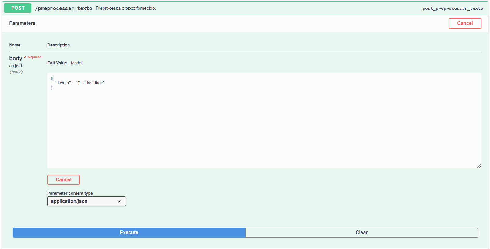 <br>
  Fonte: Elaborado pelos autores <br>
</p>

A imagem mostra a resposta da API após o processamento de um texto. O output exibido na interface inclui a frase “like uber” como parte do texto processado, indicando que o pré-processamento foi realizado com sucesso.

<p align="center">
  Figura 39 - Teste bem-sucedido - Rota de Pré Processamento<br>
  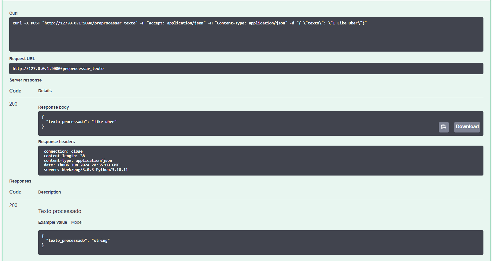 <br>
  Fonte: Elaborado pelos autores <br>
</p>

#### Pré-Condição:
- O sistema deve estar funcionando corretamente e acessível.
- O endpoint de pré-processamento deve estar operacional e capaz de receber requisições.
- O pipeline de pré-processamento deve estar configurado corretamente para processar o texto fornecido.
  
#### Procedimento de Teste:
- Enviar uma requisição POST para a rota de pré-processamento com um texto de exemplo no corpo da requisição.
- Verificar se o sistema retorna uma resposta HTTP 200, indicando que a requisição foi processada com sucesso.
- Verificar se a resposta inclui o texto pré-processado corretamente de acordo com o pipeline de pré-processamento.
- Enviar várias requisições com diferentes textos e verificar se o sistema pré-processa corretamente todos os textos.
  
#### Pós-Condição:
- O sistema deve ser capaz de pré-processar corretamente qualquer texto fornecido.
- O sistema deve retornar o texto pré-processado na resposta da requisição.
- O sistema deve manter sua disponibilidade e desempenho mesmo após processar várias requisições.

### Endpoint: Rota de Vetorização

<i>Input</i> para o teste do endpoint de vetorização na interface do Swagger, a frase fornecida é “I like Uber”. Isso indica que o usuário está testando a funcionalidade de vetorização do endpoint com essa entrada de texto.

<p align="center">
  Figura 40 - Teste bem-sucedido - Rota de Vetorização<br>
  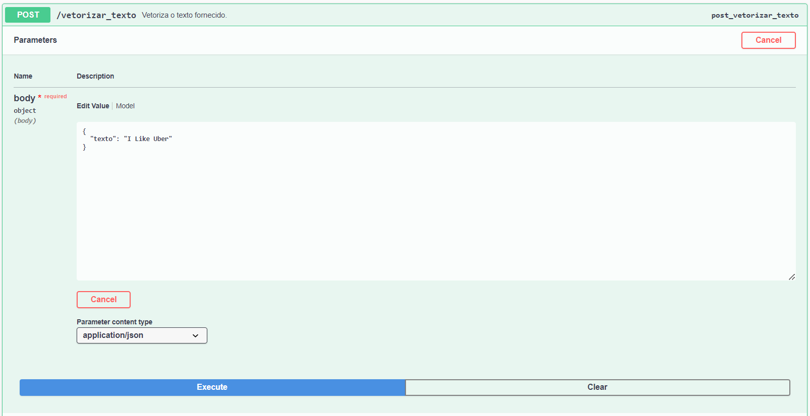 <br>
  Fonte: Elaborado pelos autores <br>
</p>

A imagem mostra a resposta de uma API para um pedido de vetorização. O <i>output</i> é um vetor numérico, representado na resposta como uma lista de números entre colchetes, que é o resultado do processo de vetorização de texto. Esses números são as coordenadas do vetor que representa o texto “I like Uber” no espaço de características escolhido pelo modelo de vetorização

<p align="center">
  Figura 41 - Teste bem-sucedido - Rota de Vetorização<br>
  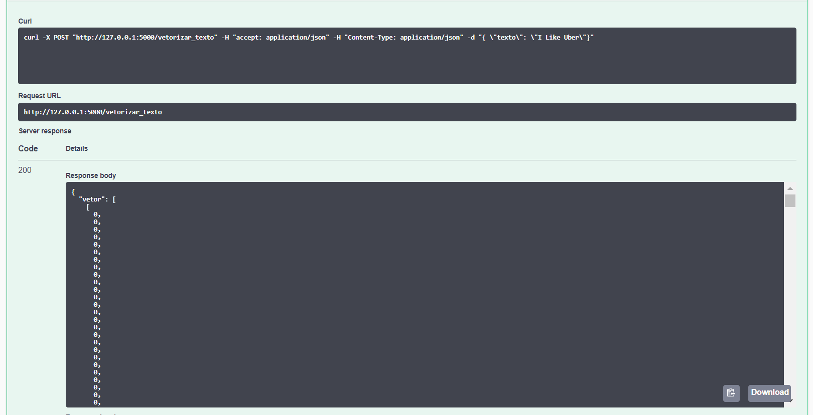 <br>
  Fonte: Elaborado pelos autores <br>
</p>

#### Pré-Condição:
- O sistema deve estar funcionando corretamente e acessível.
- O endpoint de vetorização deve estar operacional e capaz de receber requisições.
- O algoritmo de vetorização deve estar configurado corretamente para transformar o texto fornecido em vetores.
  
#### Procedimento de Teste:
- Enviar uma requisição POST para a rota de vetorização com um texto de exemplo no corpo da requisição.
- Verificar se o sistema retorna uma resposta HTTP 200, indicando que a requisição foi processada com sucesso.
- Verificar se a resposta inclui o vetor correspondente ao texto fornecido.
- Enviar várias requisições com diferentes textos e verificar se o sistema vetoriza corretamente todos os textos.
  
#### Pós-Condição:
- O sistema deve ser capaz de vetorizar corretamente qualquer texto fornecido.
- O sistema deve retornar o vetor correspondente na resposta da requisição.
- O sistema deve manter sua disponibilidade e desempenho mesmo após processar várias requisições.
  
### Endpoint: Rota de classificação

<i>Input</i> para o teste do endpoint de classificação na interface do Swagger. No campo ‘body’, espera-se que o usuário forneça dados em formato JSON para serem analisados e classificados quanto ao seu sentimento. Há também um botão “Executar”, que permite testar a API enviando uma solicitação com os dados de entrada especificados.

<p align="center">
  Figura 42 - Teste bem-sucedido - Rota de Classificação <br>
  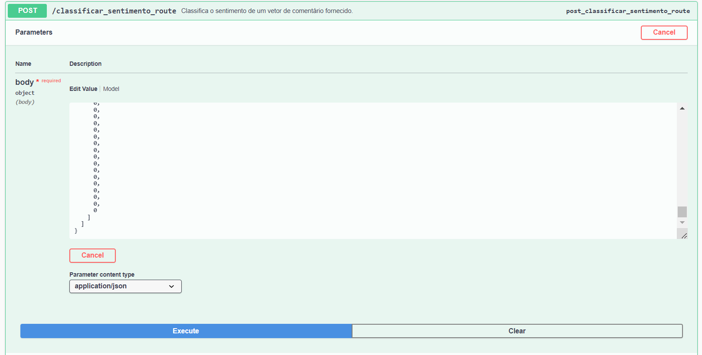 <br>
  Fonte: Elaborado pelos autores <br>
</p>

<i>Output</i> do teste do endpoint de classificação na interface do Swagger, indicando o resultado com o valor “0”, que representa um sentimento neutro, podemos concluir que o teste foi executado com sucesso.

<p align="center">
  Figura 43 - Teste bem-sucedido - Rota de Classificação <br>
  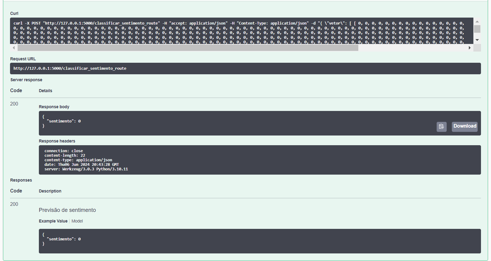 <br>
  Fonte: Elaborado pelos autores <br>
</p>

#### Pré-Condição:
- O sistema deve estar funcionando corretamente e acessível.
- O endpoint de classificação do modelo deve estar operacional e capaz de receber requisições.
- O modelo de classificação deve estar treinado e pronto para fazer previsões.
  
#### Procedimento de Teste:
- Enviar uma requisição POST para a rota de classificação do modelo com um vetor de exemplo no corpo da requisição.
- Verificar se o sistema retorna uma resposta HTTP 200, indicando que a requisição foi processada com sucesso.
- Verificar se a resposta inclui a classificação correta para o vetor fornecido.
- Enviar várias requisições com diferentes vetores e verificar se o sistema classifica corretamente todos os vetores.
  
#### Pós-Condição:
- O sistema deve ser capaz de classificar corretamente qualquer vetor fornecido.
- O sistema deve retornar a classificação na resposta da requisição.
- O sistema deve manter sua disponibilidade e desempenho mesmo após processar várias requisições.
  
### Endpoint: Rota Geral

#### Pré-Condição:
- O sistema deve estar funcionando corretamente e acessível.
- A rota geral deve estar operacional e capaz de receber requisições.
- As rotas de pré-processamento, vetorização e classificação do modelo devem estar funcionando corretamente.
  
#### Procedimento de Teste:
- Enviar uma requisição POST para a rota geral com um texto de exemplo no corpo da requisição.
- Verificar se o sistema retorna uma resposta HTTP 200, indicando que a requisição foi processada com sucesso.
- Verificar se a resposta inclui o texto pré-processado, o vetor correspondente e a classificação correta.
- Enviar várias requisições com diferentes textos e verificar se o sistema processa corretamente todos os textos através das três rotas.
  
#### Pós-Condição:
- O sistema deve ser capaz de processar corretamente qualquer texto fornecido através das três rotas.
- O sistema deve retornar o texto pré-processado, o vetor correspondente e a classificação na resposta da requisição.
- O sistema deve manter sua disponibilidade e desempenho mesmo após processar várias requisições.
- O sistema faz a previsão do sentimento do texto fornecido

### Conclusão

A execução de testes de API é uma prática indispensável no ciclo de desenvolvimento de <i>software</i>. Esses testes asseguram que as funcionalidades implementadas estejam em conformidade com as especificações técnicas e de negócio, permitem a identificação precoce de problemas, e garantem a performance e a segurança das APIs. Ferramentas como Postman, Swagger e <i>frameworks</i> de programação como Pytest e RestAssured são recursos valiosos que facilitam a automação e a integração desses testes. Cada empresa deve selecionar as ferramentas e métodos que melhor se adequem às suas necessidades, visando sempre a criação de APIs robustas e bem documentadas, que proporcionem uma experiência de integração fluida e segura. A atenção aos testes de API não apenas aprimora a qualidade dos <i>softwares</i>, mas também contribui significativamente para a satisfação dos usuários finais.

### 4.4 Arquitetura do Projeto

&emsp;&emsp;A arquitetura de embarramento, ou message bus architecture, é um padrão de design que permite visualizar a comunicação entre os diferentes componentes de um sistema distribuído através de um canal central. Esta abordagem facilita a integração e implementação de microsserviços, permitindo que eles se comuniquem de forma assíncrona e desacoplada, promovendo maior escalabilidade e facilidade na manutenção do sistema. 

&emsp;&emsp;A API de embarramento descrita nesta documentação foi projetada de forma modular para simplificar a implementação e gestão dos microsserviços, garantindo flexibilidade e eficiência no envio e busca de informações dentro do sistema, mostrando o caminho completo do <i>input</i> feito pelo usuário até a obtenção de uma resposta, assim, é possível visualizar o fluxo percorrido e as manipulações realizadas com o dado inserido.[12]

<p align="center">
  Figura 44 - Arquitetura de embarramento da API<br>
  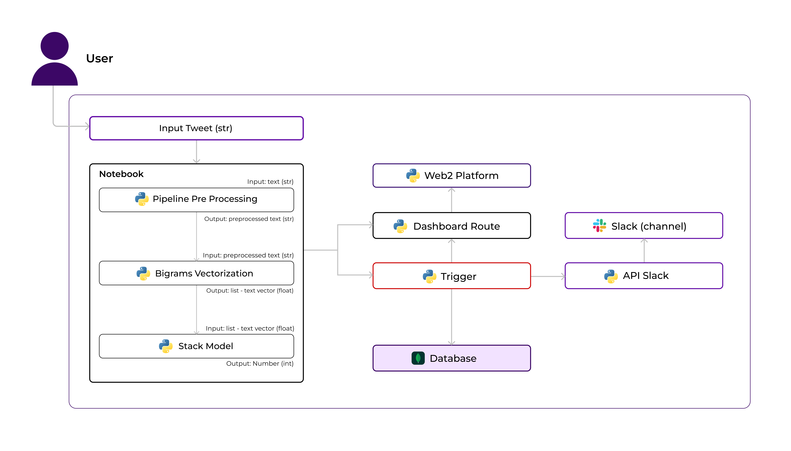 <br>
  Fonte: Elaborado pelos autores <br>
</p>

&emsp;&emsp;A API está sendo aplicada para a análise de sentimento em tweets, o fluxo ocorre da seguinte maneira: 

- **Input do usuário:** um tweet é enviado para a API em formato de string;

- **Pré processamento:** o tweet é direcionado a um microsserviço de pré-processamento, o qual limpa o texto, removendo stopwords, URLs, números, entre outras etapas de limpeza;

- **Vetorização:** em seguida, o dado é direcionado a outro microsserviço que realiza a vetorização, utilizando a técnica de Bag of Words Bigrams, transformando o texto em uma representação numérica adequada para algoritmos de <i>Machine Learning</i>;

- **Previsão:** o vetor resultante é enviado para o microsserviço de predição, onde o modelo Stack de <i>Machine Learning</i>, previamente treinado, avalia o sentimento do tweet (positivo, negativo ou neutro); 

&emsp;&emsp;Após a predição, o resultado é direcionado ao trigger, que registra a informação em um banco de dados e, simultaneamente, realiza uma consulta no mesmo. Dessa forma, ele avalia qual caminho do fluxo será seguido dali em diante. Caso ele consulte o banco de dados e note que houve o registro de muitos dados negativos nas últimas horas, a API do Slack é acionada e uma mensagem de alerta é direcionada ao canal do Slack, onde o usuário receberá o feedback do <i>input</i>. Além desse caminho, uma outra rota também é acionada e envia o resultado para um <i>dashboard</i> web, onde o usuário pode visualizar as análises de sentimento de forma clara e ter um panorama temporal em relação aos dados, encerrando o fluxo.

&emsp;&emsp;Essa abordagem baseada em módulos (microsserviços) não só promove a escalabilidade e manutenção do sistema, como também assegura que cada etapa do processamento seja executada de maneira eficiente e isolada. A capacidade de adicionar, atualizar ou substituir os microsserviços individualmente permite que o sistema evolua e se adapte a novas necessidades com facilidade, tornando a API uma solução flexível e escalável para a Uber.

# <a id="c5"></a>5. Desenvolvimento do Front-end

## 5.1 Introdução

<p align="justify">
&emsp;&emsp;Neste capítulo, abordaremos o desenvolvimento do <i>front-end</i> do projeto Sensio, um <i>dashboard</i> interativo para análise de sentimentos. O objetivo do <i>front-end</i> é fornecer uma interface amigável para os usuários interagirem com os dados, permitindo a inserção, visualização e análise dos comentários sobre a Uber. Utilizamos o Streamlit como <i>framework</i> principal para o desenvolvimento da aplicação web.</p>

## 5.2 Streamlit

### Por que utilizamos o Streamlit?

<p align="justify">
&emsp;&emsp;O Streamlit é uma biblioteca de código aberto em Python que facilita a criação de aplicativos web interativos para ciência de dados e aprendizado de máquina. A escolha do Streamlit para o desenvolvimento do <i>front-end</i> do Sensio se deve aos fatores:</p>

- **Facilidade de uso:** Streamlit permite a construção rápida de interfaces de usuário com poucos comandos de Python, sem a necessidade de conhecimentos avançados em HTML, CSS ou JavaScript.
- **Integração com Python:** Como uma biblioteca Python, o Streamlit se integra perfeitamente com outras bibliotecas e ferramentas de ciência de dados, como Pandas, Matplotlib e Plotly.
- **Interatividade:** O Streamlit oferece uma série de widgets interativos, como sliders, botões e caixas de texto, que facilitam a criação de aplicações dinâmicas.
- **Desenvolvimento rápido:** Com o Streamlit, é possível prototipar e iterar rapidamente, permitindo um ciclo de desenvolvimento ágil.

## 5.3 Componentes do Front-end

<p align="justify">
&emsp;&emsp;O <i>front-end</i> do Sensio é composto por várias seções, cada uma com uma funcionalidade. A seguir, detalhamos esses componentes:</p>

### Sidebar

<p align="justify">
&emsp;&emsp;A barra lateral (sidebar) fornece informações sobre o projeto e instruções para os usuários. Ela contém descrições dos componentes do <i>dashboard</i>, suas limitações e como utilizá-los.</p>

#### Componentes da Sidebar

- **Title:** "Discover Sensio"
- **Sections:**
  - **Comment Analysis:** Explica como os usuários podem inserir um comentário, que será pré-processado, classificado e armazenado no banco de dados.
  - **Database Visualization:** Descreve a funcionalidade de visualização dos comentários armazenados e suas classificações de sentimento.
  - **Sentiment Thermometer:** Apresenta o termômetro de sentimento e explica como ele indica o estado geral baseado na porcentagem de comentários negativos.
  - **Sentiment Overview:** Fornece uma visão geral dos comentários negativos, neutros e positivos, juntamente com tópicos em destaque para cada categoria.

### Comment Analysis

<p align="justify">
&emsp;&emsp;Nesta seção, os usuários podem inserir uma frase para ser analisada. A frase é enviada para a API, que realiza o pré-processamento e a classificação do sentimento. O resultado da classificação é exibido abaixo da frase inserida, permitindo que o usuário veja imediatamente se o sentimento é positivo, neutro ou negativo.</p>

### Database Visualization

<p align="justify">
&emsp;&emsp;Esta seção apresenta uma tabela com todos os comentários armazenados no banco de dados e suas respectivas classificações de sentimento. A tabela é atualizada em tempo real, refletindo as inserções de novos comentários e suas análises.</p>

### Sentiment Thermometer

<p align="justify">
&emsp;&emsp;O termômetro de sentimento é um indicador visual do estado geral dos sentimentos dos usuários em relação à Uber. Ele é baseado na porcentagem de comentários negativos em relação ao total de comentários. As cores do termômetro variam de verde (ótimo) a vermelho (muito ruim), oferecendo uma rápida compreensão do estado atual.</p>

#### Cálculo do Sentiment Score

<p align="justify">
&emsp;&emsp;A pontuação do sentimento é calculada como:</p>

Sentiment Score = (Número de Comentários Negativos / Total de Comentários) x 100

### Sentiment Overview

<p align="justify">
&emsp;&emsp;Esta seção oferece uma visão detalhada das três categorias de sentimento: negativo, neutro e positivo. Para cada categoria, são exibidos:</p>

- **Total de Comentários:** Número total de comentários naquela categoria.
- **Trending Topics:** Nuvem de palavras gerada a partir dos comentários pré-processados, destacando os tópicos mais frequentes em cada categoria.

## 5.4 Conclusão

<p align="justify">
&emsp;&emsp;O desenvolvimento do <i>front-end</i> do Sensio utilizando o Streamlit permitiu a criação de um <i>dashboard</i> interativo e funcional com facilidade e rapidez. A interface intuitiva possibilita aos usuários inserir, visualizar e analisar comentários sobre a Uber de forma eficiente.</p>

# <a id="c6"></a>6. Documentação Crud Database

## 6.1 Introdução

<p align="justify">
&emsp;&emsp;Esta sessão tem como objetivo fornecer uma visão abrangente e detalhada do sistema de gerenciamento de dados de tweets. Ela abrange a visão geral e objetivo do sistema, estrutura do banco de dados, tecnologias utilizadas, as operações CRUD (Create, Read, Update, Delete) realizadas no sistema e os testes do CRUD, oferecendo um suporte para desenvolvedores e administradores. Cada seção é projetada para facilitar o entendimento e a utilização do sistema, garantindo a correta implementação, manutenção e escalabilidade do projeto a longo prazo.

## 6.2 Visão Geral do Sistema

<p align="justify">
&emsp;&emsp;O sistema foi desenvolvido com base em um banco de dados de tweets com funcionalidades de classificação de sentimentos e operações CRUD (Create, Read, Update e Delete). Cada tweet é representado por três atributos principais: o sentimento, que indica se é negativo (-1), neutro (0) ou positivo (1); o texto do tweet; e um identificador único (ID). As operações CRUD permitem a manipulação eficiente dos registros, desde a inserção até a exclusão, garantindo a integridade e a consistência dos dados. Esta estruturação do sistema em torno dessas funcionalidades visa facilitar a análise e o gerenciamento de grandes volumes de informações textuais, proporcionando <i>insights</i> sobre as opiniões e tendências nas redes sociais. O banco de dados utilizado é o MongoDB, um sistema de gerenciamento de banco de dados não relacional (NoSQL) baseado em documentos, que oferece flexibilidade na estrutura dos dados e alta escalabilidade para lidar com grandes volumes de informações textuais.


### Objetivo do Crud

<p align="justify">
&emsp;&emsp;CRUD é um acrônimo para Create, Read, Update e Delete, que são as quatro operações básicas de persistência de dados em um sistema de banco de dados. O objetivo das operações CRUD é permitir a criação, leitura, atualização e exclusão de registros no banco de dados de forma eficiente e estruturada. Essas operações garantem que os dados sejam manipulados de maneira segura e consistente, permitindo a correta classificação e armazenamento dos tweets. [13]

- Create (Criação): Adiciona novos registros ao banco de dados. No contexto deste sistema, permite a inserção de novos tweets com suas respectivas classificações de sentimento.
  
- Read (Leitura): Recupera registros do banco de dados. Permite a leitura de tweets existentes, possibilitando a visualização e análise dos dados.
  
- Update (Atualização): Modifica registros existentes no banco de dados. Facilita a atualização do conteúdo dos tweets ou das classificações de sentimento associadas a eles.
  
- Delete (Exclusão): Remove registros do banco de dados. Permite a exclusão de tweets que não são mais necessários ou que precisam ser removidos por qualquer motivo.

### Estrutura dos Dados

Os dados são compostos por 3 colunas, Id, Sentimento e o Tweet, a estrutura inclui:

- ID: Um identificador único para cada tweet, essencial para diferenciar e acessar registros individualmente.
  
- Tweet: O texto do tweet, armazenado como uma string, representando o conteúdo textual da publicação.
  
- Sentimento: Um número inteiro que classifica o sentimento do tweet, facilitando análises de opinião e sentimentos.
  
Cada campo no banco de dados é validado para assegurar a integridade dos dados. As regras de validação incluem a verificação do tipo de dado e a unicidade do identificador. Esta estrutura permite uma organização eficiente dos dados e facilita a execução das operações CRUD, garantindo a consistência e a confiabilidade das informações armazenadas.

## 6.3 Tecnologias utilizadas

### MongoDB

<p align="justify">
&emsp;&emsp;MongoDB é um sistema de gerenciamento de banco de dados não relacional (NoSQL) baseado em <i>software</i> livre. Ele utiliza documentos flexíveis em vez de tabelas e linhas para processar e armazenar dados variados. Os documentos do MongoDB são formatados como BSON (Binary JSON), que podem armazenar diferentes tipos de dados e serem distribuídos em diversos sistemas. [14]

<p align="justify">
&emsp;&emsp;Características do MongoDB:
Esquema Dinâmico: Permite flexibilidade na criação de registros de dados sem a necessidade de um esquema pré-definido.
Alta Escalabilidade: Ideal para aplicativos que necessitam de um ambiente altamente escalável.
Modelos de Dados Flexíveis: Permite armazenar e consultar diferentes tipos de dados com facilidade.
Alta Disponibilidade: Proporciona replicação de dados automática para garantir disponibilidade contínua.

### Python

<p align="justify">
&emsp;&emsp;Python é uma linguagem de programação de alto nível, conhecida por sua simplicidade e legibilidade, o que facilita o desenvolvimento rápido e eficiente de aplicações. Python é amplamente utilizado em diversas áreas, como desenvolvimento web, análise de dados, automação de tarefas e inteligência artificial. No contexto do projeto o python foi utilizado desde a preparação e pré-processamento dos dados, com a remoção de caracteres especiais e tokenização, até a construção de modelos de aprendizado de máquina e deep learning para análise de sentimento. Além disso, Python facilita a visualização dos resultados por meio da criação de gráficos e integração de bibliotecas populares de NLP, como spaCy e NLTK. A linguagem também é utilizada na implementação de rotas de API com <i>frameworks</i> como o flask, possibilitando a interação com outros sistemas.

### Swagger

<p align="justify">
&emsp;&emsp;Swagger é uma ferramenta de <i>software</i> utilizada para projetar, construir, documentar e consumir APIs RESTful. Ela fornece um conjunto de ferramentas que ajudam na criação de documentação interativa e testes automatizados de APIs.

<p align="justify">
&emsp;&emsp;Características do Swagger:
Documentação Interativa: Gera documentação interativa para APIs, facilitando o entendimento e uso das mesmas por desenvolvedores.
Testes Automatizados: Permite testar as APIs diretamente na documentação, garantindo que elas funcionem conforme esperado.
Definição de API: Utiliza a especificação OpenAPI para definir a estrutura e comportamento das APIs de forma padronizada.
Visualização e Exploração de APIs: Fornece uma interface visual para explorar as endpoints da API e seus métodos.

## 6.4 Testes do Crud

### Introdução

<p align="justify">
&emsp;&emsp;Os testes realizados no sistema CRUD (Create, Read, Update, Delete) servem para garantir seu correto funcionamento e integridade dos dados. Os testes abrangem todas as operações CRUD, desde a criação até a exclusão de registros no banco de dados. Cada teste é detalhado com precondições, procedimentos de teste e pós-condições para garantir a confiabilidade do sistema.

### Testes

Teste de Criação (Create)
Pré-condição: Não há registros duplicados com o mesmo ID.

Procedimento de Teste:

- Inserir um novo registro de tweet com um ID único, texto do tweet e classificação de sentimento.
- Verificar se o registro foi inserido com sucesso no banco de dados.
- Pós-condição: Um novo registro é adicionado ao banco de dados com sucesso.

Teste de Leitura (Read)
Pré-condição: Existem registros de tweets no banco de dados.

Procedimento de Teste:

- Selecionar um registro aleatório do banco de dados.
- Ler e armazenar os dados do registro selecionado.
- Verificar se os dados lidos correspondem aos dados armazenados no banco de dados.
- Pós-condição: Os dados lidos correspondem aos dados armazenados no banco de dados.

Teste de Atualização (Update)
Pré-condição: Existem registros de tweets no banco de dados.

Procedimento de Teste:

- Selecionar um registro aleatório do banco de dados.
- Atualizar o sentimento do tweet selecionado para um valor diferente.
- Verificar se a atualização foi realizada com sucesso no banco de dados.
- Pós-condição: O sentimento do tweet selecionado é atualizado com sucesso no banco de dados.

Teste de Exclusão (Delete)
Pré-condição: Existem registros de tweets no banco de dados.

Procedimento de Teste:

- Selecionar um registro aleatório do banco de dados.
- Excluir o registro selecionado do banco de dados.
- Verificar se o registro foi removido com sucesso do banco de dados.
Pós-condição: O registro selecionado é removido com sucesso do banco de dados.

### Conclusão 

<p align="justify">
&emsp;&emsp;Os testes do CRUD foram desenvolvidos para assegurar que todas as operações de criação, leitura, atualização e exclusão no sistema sejam executadas corretamente e sem erros. Cada teste foi meticulosamente planejado com precondições, procedimentos de teste e pós-condições para garantir que o sistema funcione conforme o esperado em todas as situações. Com os testes, podemos garantir a confiabilidade e integridade do sistema de gerenciamento de dados de tweets.

## 6.5 Conclusão geral da documentação dos testes

<p align="justify">
&emsp;&emsp;Ao analisar a visão geral do sistema, fica evidente que a estruturação dos dados e a implementação das operações CRUD são fundamentais para garantir a integridade e o funcionamento eficiente do banco de dados de tweets. A escolha das tecnologias, como MongoDB e Python, demonstra uma abordagem para lidar com grandes volumes de dados textuais.

Os testes do CRUD, são essenciais para verificar a confiabilidade do sistema. Eles asseguram que todas as etapas, desde a inserção até a exclusão de registros, sejam realizadas sem erros, contribuindo para a qualidade e consistência dos dados armazenados.

Diante disso, ao implementar um sistema que necessita dessas funcionalidades, é crucial seguir os passos descritos e realizar os testes para garantir a eficácia e precisão das operações. Além disso, é importante considerar a integração de medidas de escalabilidade para atender às demandas do sistema e garantir sua eficiência a longo prazo.

# <a id="c7"></a>7. Integração Slack

<p align="justify">
&emsp;&emsp;A integração com o Slack permite que a solução desenvolvida envie alertas para um canal específico do Slack quando uma determinada quantidade de comentários negativos é atingido dentro de um período de tempo previamente definido. Essa funcionalidade é importante para monitoramento em tempo real e resposta rápida a possível problemas identificados pela aplicação.</p>

## Estrutura

<p align="justify">
&emsp;&emsp;A integração foi desenvolvida utilizando o SDK do Slack para Python (<i>slack_sdk</i>) para enviar mensagens para canais do Slack. Para isso, a integração inclui uma conexão com o banco de dados MongoDB e do token do bot do Slack. Após a configuração inicial, é definido um limiar para a quantidade de comentários negativos e o período de alerta. Para o disparo dos alertas são desenvolvidas duas funções, uma para verificação o número de comentários negativos do período de tempo definido e outra para enviar realmente as mensagens. Por fim, utilizando com registros de logs do Flask, há o registro de informações e erros.</p>

## Input

<p align="justify">
&emsp;&emsp;Para que a integração funcione adequadamente, alguns parâmetros de entrada são necessários. Primeiramente, é preciso coletar a contagem de comentários negativos do banco de dados, além de ser preciso definir um período de tempo específico durante o qual os comentários serão contatos. Outro parâmetro de entrada importante é o do canal do Slack onde o alerta deverá ser enviado. Por fim, é necessário a configuração da mensagem do alerta, que inclui o conteúdo a ser enviado ao canal, evidenciando o número de comentários negativos detectados.</p>

## Output

<p align="center">
  Figura 45 - Output no Slack<br>
   <br>
  Fonte: Elaborado pelos autores <br>
</p>

<p align="justify">
&emsp;&emsp;A saída principal da integração é uma mensagem enviada ao canal do Slack. Esta mensagem informa a quantidade de comentários negativos em um determinado período de tempo. Por exemplo, se a contagem de comentários negativos ultrapassar o limite definido, uma mensagem será envida ao Slack com os elementos descritos acima e uma sugestão para visitar o dashboard e ter uma visão completa da análise.</p>

## Conclusão

<p align="justify">
&emsp;&emsp;Ademais, essa integração garante que os usuários possam receber alertas em tempo real sobre sentimentos negativos em relação a Uber, permitindo ações rápidas para resolver reclamações dos consumidores e melhorar a qualidade do serviço.</p>

# <a id="c8"></a>8. Diagrama UML

## 8.1 Introdução

<p align="justify">
&emsp;&emsp;O diagrama de implantação UML (Unified Modeling Language) é uma representação visual que descreve a arquitetura física de um sistema de software, mostrando a disposição dos elementos de hardware (nós) e a interação entre eles, bem como os componentes de software implantados nesses nós. Este diagrama inclui nós que representam servidores, computadores e outros dispositivos, componentes que são partes do sistema de software, artefatos como arquivos executáveis e scripts, e conexões que ilustram a comunicação entre os nós. Ele é fundamental para visualizar e planejar a distribuição física do sistema, assegurando que os componentes de software estejam corretamente implantados nos respectivos elementos de hardware, sendo especialmente útil em projetos de grande escala para garantir desempenho e escalabilidade. [15]

## 8.2 Diagrama de Implantação UML

<p align="center">
  Figura 46 - Diagrama de Implantação UML<br>
   <br>
  Fonte: Elaborado pelos autores <br>
</p>

<p align="justify">
&emsp;&emsp;Este diagrama de implantação UML descreve a arquitetura de um sistema onde o input inicial é feito no front-end, executado no navegador web no computador do usuário, e em seguida, enviado para a API do servidor da aplicação via requisição HTTP, e por fim será armazenado no MongoDB (Banco de dados). A API do servidor da aplicação utiliza três endpoints principais: pré-processamento, vetorização e modelo, para processar os dados antes de armazená-los no servidor MongoDB. O sistema também possui integração com o Slack, onde um componente de interface no navegador e um conector no servidor da aplicação permitem a comunicação com o servidor do Slack via requisição HTTP. Além disso, existe uma comunicação que representa uma possível implementação futura entre a API do X (Twitter) e a API do projeto, representando uma ideia expandir a funcionalidade do sistema.

## 8.3 Conclusão

<p align="justify">
&emsp;&emsp;O diagrama de implantação UML é uma ferramenta essencial para compreender a arquitetura física de sistemas de software complexos, proporcionando uma visualização clara da interação entre componentes dsoftware. No contexto do sistema do projeto, que envolve entrada de dados via front-end web, processamento através de uma API de servidor com endpoints específicos, e armazenamento em um banco de dados MongoDB, o diagrama não apenas ilustra essa interação, mas também facilita o planejamento da distribuição física dos recursos. Além disso, a integração com o Slack e as perspectivas de expansão para incluir a API do Twitter demonstram como o diagrama de implantação UML não só ajuda a garantir desempenho e escalabilidade, mas também suporta o desenvolvimento ágil e a evolução contínua do sistema, adaptando-se às necessidades emergentes de integração e funcionalidade.

# <a id="c9"></a>9. Glossário

- Kick-off: Reunião inicial para alinhamento de expectativas e definição dos primeiros passos de um projeto.

- Hashtags: Palavras ou frases precedidas pelo símbolo # usadas para categorizar conteúdo em redes sociais.

- Brainstorming: Técnica de geração de ideias em grupo, onde todos são incentivados a compartilhar pensamentos livremente.

- DevOps: Conjunto de práticas que integra desenvolvimento (Dev) e operações (Ops) para melhorar a eficiência e qualidade do software.

- Insights: Percepções ou compreensões profundas sobre dados ou situações, que auxiliam na tomada de decisões.

- Software: Programas de computador, dados e instruções que direcionam o funcionamento de sistemas de computação.

- Dataset: Conjunto organizado de dados, geralmente em formato tabular, usado para análise e treinamento de modelos.

- Framework: Estrutura de suporte reutilizável para sistemas de software, facilitando o desenvolvimento de aplicações.

- Dashboard: Interface visual que exibe informações importantes de maneira resumida e interativa.

- Front-end: Parte visível e interativa de uma aplicação com a qual os usuários interagem diretamente.

- DataFrame: Estrutura de dados bidimensional com rótulos, semelhante a uma tabela, amplamente usada em análise de dados.

- Machine learning: Campo da inteligência artificial que desenvolve algoritmos capazes de aprender e fazer previsões a partir de dados.

- Array: Estrutura de dados que armazena uma coleção de elementos, geralmente do mesmo tipo, em posições contíguas na memória.

- Input: Dados ou informações fornecidas a um sistema para processamento.

- Output: Dados ou informações geradas por um sistema após processamento.
  

# <a id="c10"></a>10. Referências

[1] Matriz Oceano Azul.xlsx. Disponível em: <https://docs.google.com/spreadsheets/d/1zVHOET64fAUjGnMBH_Q6y3pM5ZPdA6d6/edit?usp=sharing&ouid=114207495974472939109&rtpof=true&sd=true>. Acesso em: 23 Abr. 2024.

[2] Value Proposition Canvas. Disponível em: <https://g4educacao.com/portal/value-proposition-canvas>. Acesso em: Mar. 2024.

[3] Google Cloud Platform. Google Cloud Pricing Calculator [online]. Disponível em: <https://cloud.google.com/products/calculator?utm_source=google&utm_medium=cpc&utm_campaign=latam-BR-all-pt-dr-AKWS-all-all-trial-p-dr-1011454-LUAC0013595&utm_content=text-ad-none-any-DEV_c-CRE_534950712418-ADGP_Hybrid+%7C+BKWS+-+PHR+%7C+Txt_GCP-Price+Calculator-KWID_43700071226328588-kwd-303166277948&utm_term=KW_google%20cloud%20services%20pricing-ST_google+cloud+services+pricing&gad_source=1&gclid=CjwKCAjw57exBhAsEiwAaIxaZk5ILeCyoXqLZG_OlF_wZaq3D7xh1ChP-70vOtkGEGlneIv_UIaxQBoCg2gQAvD_BwE&gclsrc=aw.ds.> Acesso em: abr. 2024.

[4] Salários de empresas. Disponível em: <https://www.glassdoor.com.br/Sal%C3%A1rios/index.htm>. Acesso em: abr. 2024.

[5] Personas. Disponível em: <https://www.mjvinnovation.com/pt-br/blog/personas-uma-ferramenta-poderosa-no-design-thinking-2/>. Acesso em: Mar. 2024.

[6] User Stories. Disponível em: <https://cwi.com.br/blog/user-stories-estruturacao-e-dicas-extras/>. Acesso em: Mar. 2024.

[7] Análise Exploratória. Disponível em: <https://www.ibm.com/br-pt/topics/exploratory-data-analysis#:~:text=A%20an%C3%A1lise%20explorat%C3%B3ria%20de%20dados,m%C3%A9todos%20de%20visualiza%C3%A7%C3%A3o%20de%20dados.>. Acesso em: Abr. 2024.

[8] Processamento de Linguagem Natural. BIRD, S. Natural language processing with python. [s.l.] O’reilly Media, 2016. Acesso em: Jun. 2024

[9] Naive Bayes. Disponível em: <https://scikit-learn.org/stable/modules/naive_bayes.html>. Acesso em: Abr. 2024.

[10] Word2Vec. Disponível em: <https://medium.com/@everton.tomalok/word2vec-e-sua-import%C3%A2ncia-na-etapa-de-pr%C3%A9-processamento-d0813acfc8ab>. Acesso em: Mai. 2024.

[11] Testes das rotas da API. Disponível em: <https://testingcompany.com.br/blog/testes-de-api-entenda-a-importancia-e-por-que-executa-los>. Acesso em: jun. 2024.

[12] LEANIX. Integration architecture. Disponível em: <https://www.leanix.net/en/wiki/it-architecture/integration-architecture?utm_term=enterprise%20integration%20pattern&utm_source=adwords&utm_medium=ppc&utm_campaign=LATIN-AMERICA-BRAZIL_Integration-Architecture-Patterns_AO_Search_ENG&hsa_ver=3&hsa_cam=21076153832&hsa_grp=164825689852&hsa_acc=2468165327&hsa_kw=enterprise%20integration%20pattern&hsa_mt=e&hsa_net=adwords&hsa_src=g&hsa_tgt=kwd-300200814120&hsa_ad=692760508481&gad_source=1&gclid=Cj0KCQjw9vqyBhCKARIsAIIcLMF-Ftp5D5PgNSqjfp9c9FrXnUI8ds1pQpLijKmMGxYVOQpJ08nK4agaAkAGEALw_wcB>. Acesso em: jun. 2024.

[13] MongoDB. Disponível em: <https://www.ibm.com/br-pt/topics/mongodb>. Acesso em: Jun. 2024.

[14] Crud. Disponível em: <https://coodesh.com/blog/dicionario/o-que-e-crud/>. Acesso em: Jun. 2024.

[15] Diagrama de Implantação UML. Disponível em <https://www.ibm.com/docs/pt-br/rsas/7.5.0?topic=topologies-deployment-diagrams>. Acesso em: Jun. 2024.

